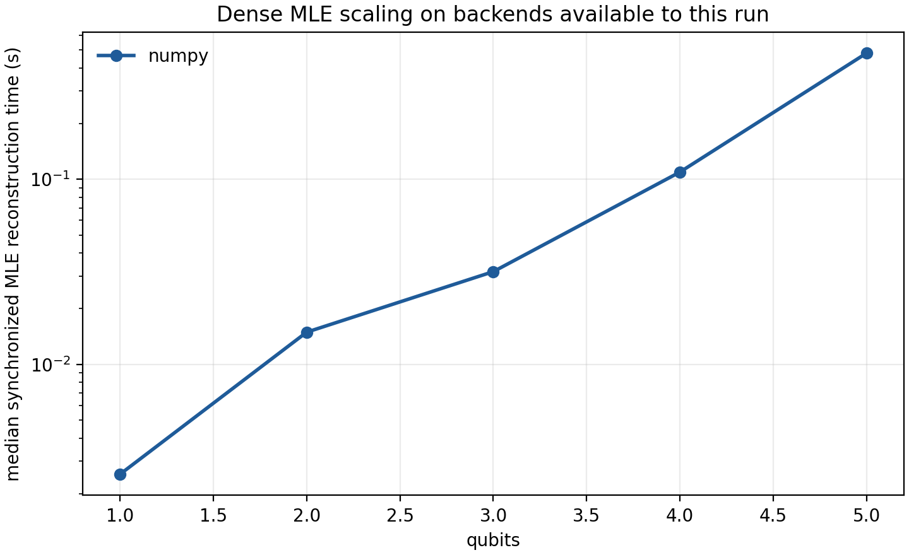
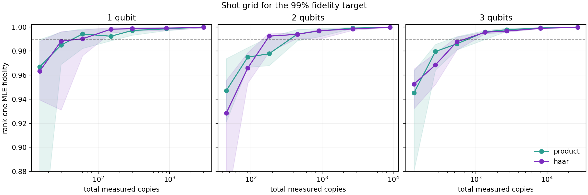
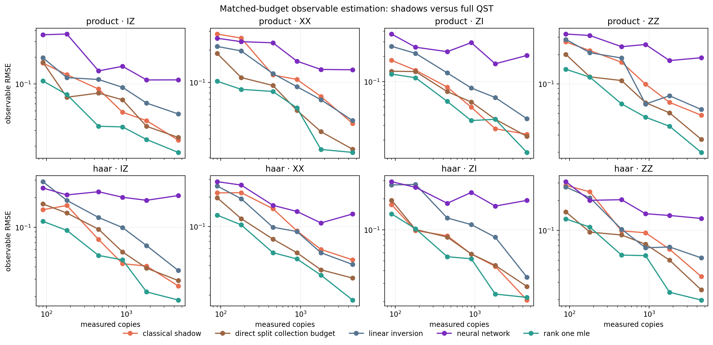

# Analytical findings: reconstruct the state only when the state is the output

## Question investigated

The extension asks where dense quantum-state tomography stops being the right
computational target. We studied three connected questions:

1. How quickly does synchronized dense MLE time grow on the CPU, and what would
   be required for a valid CPU/GPU comparison?
2. On a discrete shot grid, when does rank-one MLE first reach median fidelity
   0.99 for product and Haar-random pure states?
3. At a matched state-copy budget, when is it better to estimate selected
   observables with local-Pauli classical shadows instead of reconstructing a
   complete density matrix?

Classical shadows use independently randomized local Pauli measurements. For a
weight-`k` Pauli string, the unbiased single-snapshot estimator is nonzero only
when every supported basis matches, which occurs with probability `3**(-k)`.
The same acquired shadow can then be queried for many observables selected
after measurement. This is the local-Pauli specialization of Huang, Kueng, and
Preskill's classical-shadow framework ([arXiv:2002.08953](https://arxiv.org/abs/2002.08953)).

## Reproducible configuration

The measured results in `results/extended_study/` were generated by one Python
process on a MacBook Air (`MacBookAir10,1`) with an Apple M1, 8 CPU cores
(4 performance + 4 efficiency), 16 GB unified memory, Python 3.12.9, NumPy
1.26.4, and OpenBLAS. Thread-control environment variables were unset. The
complete machine, software, backend-availability, seed, warm-up, repeat, grid,
and estimator configuration is preserved in
`results/extended_study/extended_study_manifest.json`.

CuPy and JAX were not installed in this execution environment. Therefore the
study contains measured NumPy CPU timing only. The owner has separately
confirmed that the CuPy and JAX benchmark commands execute on one NVIDIA RTX
4060 Ti (PCIe 4, 8 GB, sm 8.7), but no synchronized timing CSVs from that node
were supplied. We do not infer or fabricate a GPU speedup.

## Finding 1 — dense MLE becomes an output-size problem

The synchronized MLE benchmark used two Haar states per size, 200 shots per
each of the `3**n` settings, eight requested MLE iterations, one warm-up, and
three timed repeats. Median reconstruction time rose from 0.00255 s at one
qubit to 0.48050 s at five qubits: a 188× increase over four added qubits.

The measured range is deliberately modest; a generic dense result already
contains `4**n` real degrees of freedom. At 20 qubits, a single complex128
density matrix requires 17,592,186,044,416 bytes (16 TiB), complete local-Pauli
acquisition has 3,486,784,401 settings, and an int64 table with every
setting/outcome value would require 29,249,267,520,503,808 bytes (about
26.0 PiB). A GPU can accelerate kernels but cannot remove these output and
acquisition sizes. The full 1–20 qubit table is in
`results/extended_study/dense_theoretical_scaling_1_to_20_qubits.csv`.

The correct GPU comparison is now automated: run the identical qubit/shot/
state/iteration grid with `--backend numpy`, `cupy`, and `jax`; preserve the
detailed CSV, summary, JSON manifest, and scheduler log; and merge them using
`tools/compare_backend_timings.py`. Compilation policy, precision, resident
weights, transfers, and synchronization must match.

## Finding 2 — the 99% threshold was similar, not systematically easier for product states

For each size and state family, eight fixed pure states were reconstructed by
rank-one multinomial MLE at 5, 10, 20, 50, 100, 300, and 1,000 shots per
setting. “Required” means the smallest tested grid point whose median fidelity
was at least 0.99; it is not an asymptotic bound.

| Qubits | Product shots/setting | Haar shots/setting | Product total copies | Haar total copies |
|---:|---:|---:|---:|---:|
| 1 | 20 | 20 | 60 | 60 |
| 2 | 50 | 20 | 450 | 180 |
| 3 | 50 | 50 | 1,350 | 1,350 |

The two-qubit Haar threshold appearing below the product threshold was
surprising, but it is not evidence that Haar states are intrinsically easier.
The generic rank-one factorization knows that both families are pure, but it
does not exploit the tensor-product structure of product states. With eight
replicates and a discrete grid, state-to-state and multinomial variation can
easily move a threshold by one grid point. A product-state-specific estimator
and substantially more replicates are required before claiming a family-level
sample-complexity separation.

## Finding 3 — shadows beat raw LI, but strong structural priors still matter

The observable study used two-qubit product and Haar states, 20 replicates,
copy budgets from 90 to 4,500, and four observables (`ZI`, `IZ`, `ZZ`, `XX`).
One shadow data set was reused for all four observables. Complete-QST methods
used all nine settings. The direct split-budget reference divided the same
collection budget across four separately targeted Pauli measurements. A
second single-target reference is retained in the raw table to show the best
case when only one observable is known in advance.

Across both state families and all four observables at 4,500 copies, aggregate
RMSE was:

| Method | Aggregate observable RMSE | What the budget buys |
|---|---:|---|
| rank-one MLE | 0.0191 | full QST + correct pure-state rank prior |
| targeted measurements, budget split four ways | 0.0264 | four observables fixed before acquisition |
| classical shadows | 0.0345 | one reusable, post-hoc-queryable data set |
| linear inversion | 0.0439 | unconstrained full density matrix |
| neural network | 0.1671 | fixed pretrained 2-qubit model |

Shadows improved on unconstrained LI and the fixed neural model while avoiding
a full state as the output. Rank-one MLE remained best because the simulated
states exactly satisfied its strong purity assumption. The targeted split
baseline also remained competitive because there were only four known Pauli
observables. The expected shadow advantage should grow when the observable
list is larger, low-weight, reused, or chosen after acquisition. For one known
observable, direct measurement is the honest default.

## Failed attempts and surprises

- The first 99%-fidelity grid started at 100 shots per setting. Every case
  passed, so it established only an uninformative upper bound. The final grid
  begins at five shots and records “not reached” instead of extrapolating.
- Raw LI sometimes produced a numerically clipped fidelity of 1.0 while having
  a negative eigenvalue. This is why the benchmark records `is_physical` and
  `fidelity_interpretable`; a clipped number does not repair an invalid state.
- The bundled neural network remained physical and very fast, but its error
  plateaued as the copy budget increased. A fixed network trained at 500 shots
  per setting did not inherit the statistical consistency of MLE and did not
  generalize uniformly across state families and budgets.
- Product states did not consistently require fewer shots than Haar states.
  The estimator encoded low rank, not product structure.
- GPU execution could not be reproduced in the local environment because JAX
  and CuPy were unavailable. Package absence and device identity are recorded
  explicitly rather than treated as successful accelerator execution.

## What we would do differently with more time

1. Run the synchronized NumPy/CuPy/JAX grid on the same saved measurement
   bundles and capture the full RTX 4060 Ti scheduler, driver, CUDA, precision,
   thread, and device manifest.
2. Compare generic rank-one MLE with a product-state ansatz, matrix-product
   states/operators, and low-rank factors as qubits increase.
3. Add calibrated/robust shadows for readout noise, median-of-means confidence
   coverage studies, derandomized measurement schedules, and hundreds of
   local observables.
4. Retrain neural models across shot counts and hardware noise families, then
   test out-of-distribution calibration rather than reporting only mean
   fidelity.
5. Separate acquisition design from reconstruction even more sharply: return
   a dense state only when downstream work truly requires one.

## Bottom line

Dense LI and MLE are invaluable validation engines for small systems. The
scalable decision is not merely which denoiser to use; it is whether a complete
density matrix is needed at all. For a small set of known observables, measure
them directly. For many low-weight or post-hoc observables, retain randomized
shadow data. For full-state tasks beyond the dense regime, change the state
representation before changing the optimizer.
