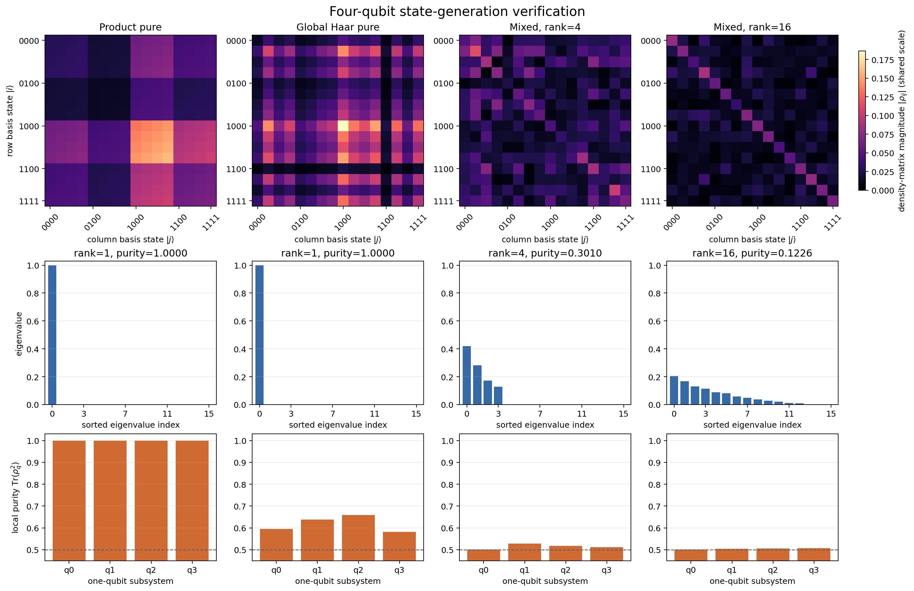
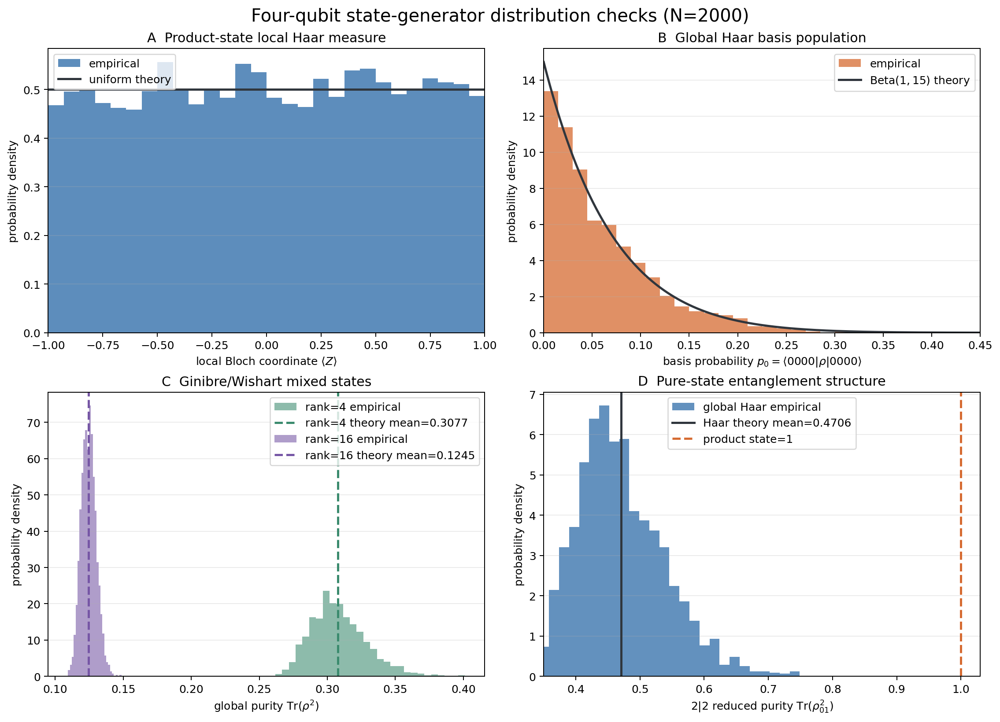

# Interpreting the Four-Qubit State-Generation Verification

## 1. Purpose and scope

The verification is split into two complementary scripts:

- `state_generation_verification.py` checks individual four-qubit density
  matrices and visualizes their structure.
- `state_distribution_verification.py` generates many independent states and
  checks whether their empirical statistics agree with the intended random
  ensembles.

The first script answers questions such as “Is this matrix a valid density
matrix?” and “Did the requested rank appear?” The second answers questions such
as “Do repeated samples behave like local Haar, global Haar, and induced
Ginibre/Wishart samples?” A single state can satisfy every density-matrix
condition while still having been drawn from the wrong distribution, so both
levels of verification are necessary.

### 1.1 Package functions covered

The table lists only the production functions that are primary verification
targets. Script-local diagnostics and analytic reference helpers are omitted.

| Package function under test | Behavior verified |
|---|---|
| `nbqst.states.random_product_state` | Returns a physical rank-one state with pure one-qubit reductions. Repeated samples have locally Haar-uniform Bloch vectors, pure $2\mid2$ reductions, and ensemble mean $I/16$. |
| `nbqst.states.haar_random_pure` | Returns a physical rank-one state with the expected entanglement structure. Repeated samples reproduce the $\operatorname{Beta}(1,15)$ fixed-basis population law, the Haar $2\mid2$ reduced-purity mean $8/17$, and ensemble mean $I/16$. |
| `nbqst.states.random_mixed_state` | Rank-4 and rank-16 calls return physical states with the requested numerical rank and reproduce the induced Ginibre/Wishart mean-purity formula and ensemble mean $I/16$. |

For four qubits, the Hilbert-space dimension is

$$
d=2^4=16,
$$

so every density matrix in these checks has shape $16\times16$.

## 2. Running the verification

From the repository root, run:

```powershell
python verification\state_generation\state_generation_verification.py
python verification\state_generation\state_distribution_verification.py
```

The distribution check uses 2,000 independent samples per ensemble by default.
The sample count and seed can be changed:

```powershell
python verification\state_generation\state_distribution_verification.py `
    --samples 5000 `
    --seed 1234
```

The scripts produce:

- `four_qubit_state_verification.png`
- `four_qubit_distribution_verification.png`

The fixed default seeds make the reference results reproducible. Changing the
seed should change individual numerical values and histogram fluctuations but
should not systematically change the conclusions.

## 3. Ensembles being tested

### 3.1 Random product pure state

Each qubit is independently generated as

$$
|\psi_q\rangle = \alpha_q|0\rangle+\beta_q|1\rangle,
$$

where the real and imaginary parts of $\alpha_q$ and $\beta_q$ are sampled
from independent normal distributions and the two-component complex vector is
normalized. A normalized isotropic complex Gaussian vector is Haar distributed,
so each local qubit is uniform on the Bloch sphere.

The four-qubit state is

$$
|\Psi_{\mathrm{prod}}\rangle
=|\psi_0\rangle\otimes|\psi_1\rangle
 \otimes|\psi_2\rangle\otimes|\psi_3\rangle.
$$

It is globally pure but contains no entanglement between the qubits.

### 3.2 Global Haar-random pure state

A length-16 complex Gaussian vector is normalized:

$$
|\Psi_{\mathrm{Haar}}\rangle
=\frac{z}{\|z\|},\qquad z\in\mathbb C^{16}.
$$

This produces the unitarily invariant Haar distribution on the full
four-qubit pure-state space. Unlike a product state, a global Haar state is
entangled across essentially every bipartition with probability one.

### 3.3 Ginibre/Wishart mixed state

For requested rank $r$, a complex Ginibre matrix

$$
G\in\mathbb C^{16\times r}
$$

is sampled and converted to

$$
\rho=\frac{GG^\dagger}{\operatorname{Tr}(GG^\dagger)}.
$$

This construction automatically makes $\rho$ Hermitian and positive
semidefinite. Because a random $G$ has full column rank with probability one,
the resulting density matrix has rank $r$ when $r\leq16$, apart from
numerical precision effects.

Equivalently,

$$
GG^\dagger=\sum_{a=1}^{r}g_a g_a^\dagger,
$$

so increasing $r$ averages more random rank-one contributions and normally
makes the state more mixed.

## 4. Single-state numerical checks

Before creating the first figure, the script applies assertions to each state.
The figure is therefore a visual explanation of states that have already
passed numerical physicality checks; it is not the only verification method.

### 4.1 Shape

The expected shape is $(16,16)$. This ensures that the returned object has the
correct Hilbert-space dimension for four qubits.

### 4.2 Hermiticity

A density matrix must satisfy

$$
\rho=\rho^\dagger.
$$

The script measures

$$
\|\rho-\rho^\dagger\|_F.
$$

Values close to machine precision indicate that Hermiticity is satisfied.

### 4.3 Unit trace

The normalization condition is

$$
\operatorname{Tr}(\rho)=1.
$$

The reported trace error is $|\operatorname{Tr}(\rho)-1|$.

### 4.4 Positive semidefiniteness

Every eigenvalue must be nonnegative. The script diagonalizes the Hermitian
part of the matrix and reports its minimum eigenvalue. Tiny negative values of
order $10^{-16}$ are ordinary floating-point eigensolver error and are not
evidence of a negative physical probability. The acceptance tolerance is
$10^{-10}$.

### 4.5 Purity

Purity is

$$
\gamma=\operatorname{Tr}(\rho^2).
$$

For a 16-dimensional state,

$$
\frac{1}{16}\leq\gamma\leq1.
$$

Pure states have $\gamma=1$. Mixed states have $\gamma<1$, with
$1/16$ attained only by the maximally mixed state $I/16$.

### 4.6 Numerical rank

The numerical rank is the number of eigenvalues larger than $10^{-10}$.
Product and global Haar pure states should have rank one. The two mixed
examples should have ranks 4 and 16, respectively.

### 4.7 One-qubit reduced purity

For each qubit $q$, the other three qubits are traced out and the script
computes

$$
\operatorname{Tr}(\rho_q^2).
$$

A one-qubit purity lies between $1/2$ and 1. Every local reduced state of a
product pure state must have purity 1. For a globally pure state, a local purity
below 1 demonstrates entanglement between that qubit and the remaining three
qubits. For a globally mixed state, a local purity close to $1/2$ indicates a
nearly maximally mixed local marginal, but by itself it does not distinguish
entanglement from classical or global mixing.

## 5. Interpreting the single-state figure



The columns show product pure, global Haar pure, rank-4 mixed, and rank-16 mixed
states. The rows show density-matrix magnitude, eigenvalue spectrum, and local
one-qubit purity.

### 5.1 Density-matrix magnitude heatmaps

The top row displays

$$
|\rho_{ij}|
$$

in the computational basis. All four panels use the same color scale, so a
darker mixed-state panel can reflect genuinely smaller matrix elements rather
than a separate per-panel normalization. The plots show magnitudes only and
therefore discard complex phase information. A heatmap alone cannot verify
Hermiticity, positivity, or the exact distribution.

#### Product pure state

For a product state,

$$
\rho=\rho_0\otimes\rho_1\otimes\rho_2\otimes\rho_3.
$$

Its heatmap consequently has a nested block or Kronecker-product texture. Bright
and dark regions repeat in a structured way because every computational-basis
amplitude is a product of four local amplitudes. The matrix is not expected to
be diagonal: a generic local qubit is a superposition of $|0\rangle$ and
$|1\rangle$, so it produces coherences.

#### Global Haar pure state

For any pure state,

$$
\rho_{ij}=\psi_i\psi_j^*,
\qquad
|\rho_{ij}|=|\psi_i||\psi_j|.
$$

The Haar heatmap is therefore also dense and rank one, but it looks more
irregular than the product heatmap because the 16 amplitudes are sampled in the
full Hilbert space rather than constructed from four two-component factors.
A relatively large amplitude $|\psi_i|$ produces a bright row and matching
bright column. This outer-product correlation is why a pure-state heatmap is
not a collection of independent pixels.

#### Rank-4 mixed state

The rank-4 state is a normalized sum of four random outer products. It no
longer has the repeated tensor-product structure of the product state or the
single-outer-product structure of a pure state. Off-diagonal coherences remain,
but contributions with unrelated phases partially cancel. The corresponding
spectrum contains four nonzero eigenvalues.

#### Rank-16 mixed state

The rank-16 state sums 16 random outer products. It is full rank and is closer,
on average, to $I/16$. This produces a more visible diagonal tendency and
smaller off-diagonal magnitudes. It should not be exactly diagonal or exactly
maximally mixed: those properties hold only as an ensemble average or in an
appropriate limiting sense, not for every finite random sample.

### 5.2 Eigenvalue spectra

The middle row directly reveals rank and global purity.

- A pure state has one eigenvalue equal to 1 and the remaining 15 equal to 0.
- The rank-4 state has four positive eigenvalues.
- The rank-16 state has 16 positive eigenvalues distributed over smaller
  values.

The spectrum is more reliable than visual density-matrix sparsity for deciding
whether a state is pure or mixed. A dense matrix can still have rank one, as
both pure-state panels demonstrate.

### 5.3 Local one-qubit purities

The bottom row uses the dashed line at $1/2$ as the maximally mixed one-qubit
reference.

- Product-state local purities are all 1, confirming the absence of
  entanglement.
- Global Haar local purities lie below 1 because each qubit is entangled with
  the other three.
- Mixed-state local purities are close to $1/2$, especially in the full-rank
  case, because the local marginals are close to maximally mixed.

## 6. Observed single-state results

The default run produced:

| State | Trace error | Hermitian error | Minimum eigenvalue | Purity | Rank |
|---|---:|---:|---:|---:|---:|
| Product pure | $2.22\times10^{-16}$ | $5.75\times10^{-17}$ | $-1.43\times10^{-16}$ | 1.000000 | 1 |
| Global Haar pure | $2.04\times10^{-18}$ | $4.90\times10^{-17}$ | $-2.52\times10^{-16}$ | 1.000000 | 1 |
| Mixed, rank 4 | $5.14\times10^{-18}$ | $4.77\times10^{-17}$ | $-6.39\times10^{-17}$ | 0.300961 | 4 |
| Mixed, rank 16 | $4.46\times10^{-19}$ | $3.65\times10^{-17}$ | $3.38\times10^{-4}$ | 0.122587 | 16 |

The tiny negative eigenvalues in analytically rank-deficient states are far
below the $10^{-10}$ tolerance and are consistent with numerical roundoff.

## 7. Distribution-level checks



The distribution script uses independent random-number streams for product,
global Haar, rank-4 mixed, and rank-16 mixed ensembles. At the default sample
count, it generates 2,000 states of each type. Because every product state
contains four independently sampled local qubits, panel A uses 8,000 local
Bloch vectors.

### 7.1 Panel A: local Haar measure for product states

A pure qubit can be represented by a unit Bloch vector

$$
\boldsymbol r=(\langle X\rangle,\langle Y\rangle,\langle Z\rangle).
$$

Uniform sampling on the Bloch sphere implies:

$$
\langle Z\rangle\sim\operatorname{Uniform}[-1,1],
$$

$$
\mathbb E[\boldsymbol r]=0,
\qquad
\mathbb E[\boldsymbol r\boldsymbol r^T]=\frac{I_3}{3},
\qquad
\|\boldsymbol r\|=1.
$$

Panel A compares the empirical histogram of $\langle Z\rangle$ with the
uniform density $1/2$. The script also checks the mean of all three Cartesian
components, their second-moment matrix, and the Bloch-vector radius. These
additional checks help detect directional bias that might not be obvious in a
single one-dimensional histogram.

The Kolmogorov-Smirnov statistic measures the maximum distance between the
empirical cumulative distribution function and the target uniform cumulative
distribution function. At significance level $\alpha=0.01$, the default run
gave

$$
D=0.01121 < D_{\mathrm{critical}}=0.01820.
$$

Thus the test does not reject local Haar uniformity.

### 7.2 Panel B: global Haar basis population

For a complex Haar-random state in dimension $d$, any fixed computational
basis probability

$$
p_i=|\psi_i|^2
$$

follows

$$
p_i\sim\operatorname{Beta}(1,d-1).
$$

For four qubits this is $\operatorname{Beta}(1,15)$, with density

$$
f(p)=15(1-p)^{14},\qquad 0\leq p\leq1.
$$

The distribution is strongly concentrated near zero because 16 nonnegative
basis probabilities must sum to one. Panel B compares the probability of the
fixed basis state $|0000\rangle$ across independent Haar samples with this
analytic density. Using one fixed component per state avoids treating the 16
dependent probabilities within one state as independent observations.

The default KS result was

$$
D=0.01336 < D_{\mathrm{critical}}=0.03640,
$$

so the target Beta distribution was not rejected.

### 7.3 Panel C: Ginibre/Wishart mixed-state purity

For a complex induced state constructed from a $d\times r$ Ginibre matrix,
the analytic mean purity is

$$
\mathbb E[\operatorname{Tr}(\rho^2)]
=\frac{d+r}{dr+1}.
$$

With $d=16$:

$$
\mathbb E[\gamma]_{r=4}=\frac{20}{65}\approx0.307692,
$$

$$
\mathbb E[\gamma]_{r=16}=\frac{32}{257}\approx0.124514.
$$

Panel C shows the empirical purity distributions. The dashed vertical lines
show the theoretical means, not the full theoretical probability densities.
The rank-4 ensemble is visibly more pure because only four eigen-directions are
occupied. The rank-16 ensemble spreads weight over the full Hilbert space and
is closer to the minimum possible purity $1/16=0.0625$.

The observed means were 0.308652 and 0.124636, respectively. Both differences
from theory were inside the five-standard-error acceptance bands.

### 7.4 Panel D: pure-state entanglement structure

The four qubits are divided into two two-qubit subsystems. After tracing out one
side, the reduced state has dimension 4. Its purity lies between $1/4$ and 1.

For every product state, the reduced state remains pure:

$$
\operatorname{Tr}(\rho_{01}^2)=1.
$$

For a global Haar pure state on an $m\times n$ bipartite system, the expected
reduced purity is

$$
\mathbb E[\operatorname{Tr}(\rho_A^2)]
=\frac{m+n}{mn+1}.
$$

Here $m=n=4$, so

$$
\mathbb E[\operatorname{Tr}(\rho_{01}^2)]
=\frac{8}{17}\approx0.470588.
$$

Panel D shows the Haar distribution around this mean and the product-state
reference at 1. The separation is a direct visualization of the difference
between a tensor product of local Haar states and a Haar state on the full
Hilbert space.

### 7.5 Ensemble-average density matrix

Every tested ensemble should have maximally mixed mean:

$$
\mathbb E[\rho]=\frac{I}{16}.
$$

For product states this follows because each local Haar average is $I/2$, and

$$
\mathbb E[\rho_0\otimes\rho_1\otimes\rho_2\otimes\rho_3]
=\left(\frac{I}{2}\right)^{\otimes4}
=\frac{I}{16}.
$$

For the global Haar and Ginibre/Wishart ensembles it follows from unitary
invariance. The script compares each empirical average with $I/16$ using the
Frobenius norm. These errors should decrease approximately as
$1/\sqrt{N}$ as the number of independent samples $N$ increases.

## 8. Observed distribution-check results

The default 2,000-sample run produced the following results. “Observed” is an
error or test statistic, so smaller is better.

| Check | Observed | Acceptance limit | Result |
|---|---:|---:|---|
| Product Bloch-$Z$ KS | 0.011205 | 0.018197 | Pass |
| Product Bloch mean error | 0.010044 | 0.032275 | Pass |
| Product Bloch isotropy error | 0.003565 | 0.016667 | Pass |
| Product Bloch radius error | $1.33\times10^{-15}$ | $10^{-10}$ | Pass |
| Haar basis-probability KS | 0.013362 | 0.036395 | Pass |
| Haar $2\mid 2$ mean-purity error | 0.000582 | 0.007663 | Pass |
| Product $2\mid 2$ purity error | 0 | 0.000500 | Pass |
| Mixed rank-4 mean-purity error | 0.000960 | 0.002312 | Pass |
| Mixed rank-16 mean-purity error | 0.000123 | 0.000611 | Pass |
| Product ensemble-mean error | 0.021034 | 0.108253 | Pass |
| Haar ensemble-mean error | 0.022245 | 0.108253 | Pass |
| Mixed rank-4 ensemble-mean error | 0.010573 | 0.055362 | Pass |
| Mixed rank-16 ensemble-mean error | 0.005292 | 0.027842 | Pass |

## 9. How to interpret pass and failure

Passing a statistical test does not prove that an implementation exactly
follows the target distribution. It means that the selected statistics did not
find evidence against that distribution at the chosen sample size and
thresholds. The checks cover several independent consequences of the target
ensembles so that common implementation errors are likely to be exposed:

- sampling only real amplitudes would break Bloch-sphere isotropy;
- sampling complex entries from an anisotropic distribution could bias Bloch
  moments or basis populations;
- constructing a global Haar state as a tensor product would make the $2\mid 2$
  reduced purity equal to 1 instead of approximately $8/17$;
- forming $G^\dagger G$ instead of $GG^\dagger$ would produce the wrong
  matrix shape;
- omitting trace normalization would fail both single-state checks and purity
  predictions;
- mishandling the requested Ginibre width would fail the rank and mean-purity
  checks.

A statistical test can occasionally fail even for a correct random generator.
The KS tests use $\alpha=0.01$, and mean comparisons use five empirical
standard errors with a small numerical floor. If one check fails:

1. inspect which physical or distributional property failed;
2. rerun with a different seed;
3. increase `--samples` to reduce Monte Carlo noise;
4. treat a persistent or growing discrepancy as evidence of an implementation
   problem.

For publication-level validation, results should be repeated over several
independent seeds, uncertainty should be reported explicitly, and the family of
multiple hypothesis tests should be handled with an appropriate global error
control procedure. The present scripts are reproducible engineering and
scientific sanity checks, not a formal proof of correctness.
