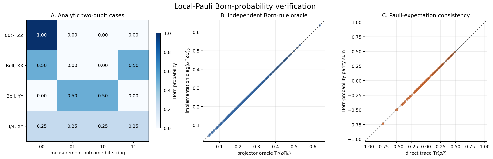
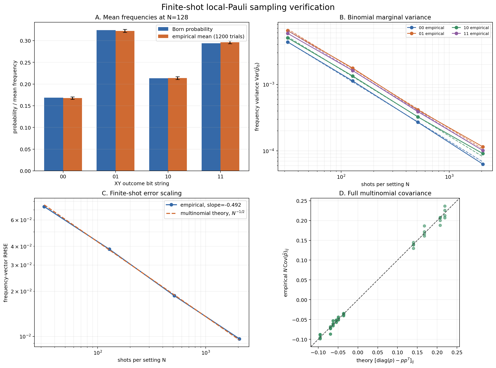
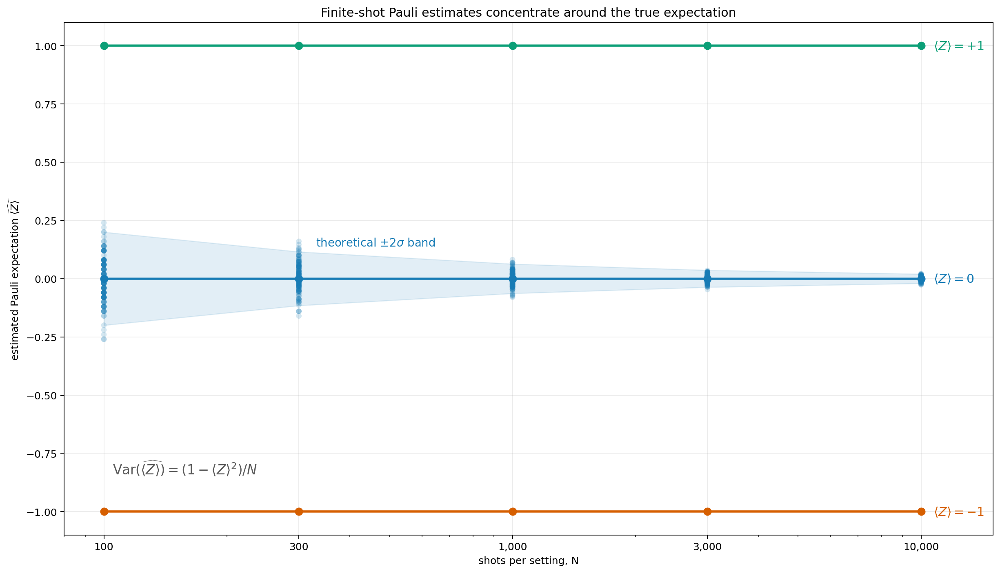

# Interpreting the Local-Pauli Measurement-Simulation Verification

## 1. Purpose and scope

The verification is split into two complementary scripts:

- `born_probability_verification.py` checks the deterministic Born-rule layer.
- `sampling_distribution_verification.py` checks the stochastic finite-shot
  layer against multinomial theory.

This separation is important. Correct Born probabilities do not guarantee that
the sampler draws the right distribution, and apparently plausible sampled
frequencies do not prove that the underlying basis rotation is correct. The two
scripts therefore answer different questions:

1. Does `pauli_probabilities(rho, setting)` calculate the physical probability
   of every outcome?
2. Does `simulate_pauli_measurements(...)` generate counts with the correct
   mean, variance, covariance, and shot-noise scaling?

### 1.1 Package functions covered

The table lists only the production functions that are primary verification
targets. The independent projector oracle and script-local calculations are
omitted.

| Package function under test | Behavior verified |
|---|---|
| `nbqst.measurements.complete_pauli_settings` | For two qubits, returns all $3^2=9$ local-Pauli settings with neither omissions nor duplicates. |
| `nbqst.measurements.pauli_probabilities` | Matches analytic Born probabilities and an independent tensor-product projector oracle; results are nonnegative, normalized, and consistent with direct Pauli traces. |
| `nbqst.measurements.simulate_pauli_measurements` | Conserves shots, produces nonnegative counts, reproduces the target multinomial mean and covariance, follows the expected $N^{-1/2}$ RMSE law, and gives the correct concentration behavior for Pauli expectation estimates. |

The code under verification is
[`src/nbqst/measurements.py`](../../src/nbqst/measurements.py), together with
the measurement bases defined in
[`src/nbqst/operators.py`](../../src/nbqst/operators.py).

## 2. Running the verification

From the repository root, run:

```powershell
python verification\measurement_simulation\born_probability_verification.py
python verification\measurement_simulation\sampling_distribution_verification.py
```

The scripts produce:

- `born_probability_verification.png`
- `finite_shot_sampling_verification.png`
- `pauli_expectation_concentration.png`

The finite-shot script uses 1,200 repeated experiments by default. Its trial
count and seed can be changed:

```powershell
python verification\measurement_simulation\sampling_distribution_verification.py `
    --trials 3000 `
    --seed 1234
```

At least 100 trials are required because a covariance matrix estimated from too
few repetitions is too unstable for the selected acceptance checks. The fixed
default seeds make the recorded results reproducible. Changing the seed should
change the Monte Carlo fluctuations, but not produce a persistent bias or a
different scaling law.

## 3. Local-Pauli measurement convention

For an $n$-qubit density matrix $\rho$, one measurement setting is a string

$$
s=(s_0,\ldots,s_{n-1})\in\{X,Y,Z\}^n.
$$

There are $3^n$ complete local-Pauli settings and $2^n$ outcomes per setting.
The implementation uses big-endian outcome bit strings: the leftmost bit refers
to qubit 0. At each qubit,

- outcome bit 0 denotes the $+1$ eigenstate of the selected Pauli operator;
- outcome bit 1 denotes the $-1$ eigenstate.

If $U_s$ contains the selected tensor-product eigenvectors as columns, the
production implementation calculates

$$
p_{\mathrm{rotation}}(b\mid s)
=\left[U_s^\dagger\rho U_s\right]_{bb}.
$$

The resulting probabilities should be real, nonnegative, and normalized:

$$
p(b\mid s)\geq0,
\qquad
\sum_{b=0}^{2^n-1}p(b\mid s)=1.
$$

Small negative floating-point values are clipped by the production function
before the vector is renormalized. The deterministic verification uses valid
density matrices and a tolerance of $2\times10^{-12}$, so clipping cannot hide
a material error in the tested cases.

## 4. Independent projector oracle

A test is weak if it repeats the production calculation using the same basis
rotation. A wrong $Y$ eigenvector or a misplaced conjugate transpose could then
appear in both calculations and cancel. The deterministic script therefore
uses a second formulation of the Born rule.

For axis $s_j$ and outcome bit $b_j$, the one-qubit projector is

$$
\Pi_{s_j,b_j}
=\frac{I+(-1)^{b_j}\sigma_{s_j}}{2}.
$$

The joint projector and reference probability are

$$
\Pi_{s,b}
=\bigotimes_{j=0}^{n-1}\Pi_{s_j,b_j},
\qquad
p_{\mathrm{projector}}(b\mid s)
=\operatorname{Tr}(\rho\Pi_{s,b}).
$$

This oracle directly constructs projectors from independent $I$, $X$, $Y$,
and $Z$ matrices. It does not import the production rotation matrices. The
script compares the two formulations for eight independently generated
full-rank two-qubit states, all nine settings in $\{X,Y,Z\}^2$, and all four
outcomes per setting.

The default run checks 288 random-state probabilities. Its maximum discrepancy
was

$$
\max_{\rho,s,b}
|p_{\mathrm{rotation}}-p_{\mathrm{projector}}|
=1.11\times10^{-16},
$$

which is at double-precision rounding scale and far below the acceptance
tolerance.

## 5. Analytically known reference states

Before using random states, the deterministic script evaluates cases with
known answers.

| State | Setting | Expected outcome probabilities |
|---|---|---|
| $\lvert 0\rangle$ | $Z$ | $(1,0)$ |
| $\lvert 0\rangle$ | $X$ | $(1/2,1/2)$ |
| $\lvert +\rangle$ | $X$ | $(1,0)$ |
| $\lvert +i\rangle$ | $Y$ | $(1,0)$ |
| $I/2$ | $Y$ | $(1/2,1/2)$ |
| $\lvert 00\rangle$ | $ZZ$ | $(1,0,0,0)$ |
| $\lvert\Phi^+\rangle$ | $XX$ | $(1/2,0,0,1/2)$ |
| $\lvert\Phi^+\rangle$ | $YY$ | $(0,1/2,1/2,0)$ |
| $I/4$ | $XY$ | $(1/4,1/4,1/4,1/4)$ |

Here

$$
|+i\rangle=\frac{|0\rangle+i|1\rangle}{\sqrt2},
\qquad
|\Phi^+\rangle=\frac{|00\rangle+|11\rangle}{\sqrt2}.
$$

The $|+i\rangle$ case is a regression guard for the sign and conjugation of the
$Y$ basis. Real-amplitude states alone cannot reveal every $Y$-basis mistake.
The Bell state distinguishes correlated $XX$ and $ZZ$ outcomes from
anticorrelated $YY$ outcomes:

$$
\langle XX\rangle=1,
\qquad
\langle YY\rangle=-1,
\qquad
\langle ZZ\rangle=1.
$$

The asymmetric outcome $|00\rangle$ also helps verify the outcome-index and
qubit-ordering conventions.

## 6. Pauli-expectation consistency

Born probabilities and Pauli expectation values are two representations of the
same measurement statistics. For a full setting $s$, the product of the
observed $\pm1$ eigenvalues gives

$$
\langle P_s\rangle
=\sum_b(-1)^{\operatorname{popcount}(b)}p(b\mid s),
$$

and this must equal

$$
\operatorname{Tr}(\rho P_s),
\qquad
P_s=\sigma_{s_0}\otimes\cdots\otimes\sigma_{s_{n-1}}.
$$

The same outcome distribution also determines lower-support observables. For
example, setting $XY$ simultaneously measures $XI$, $IY$, and $XY$; unused
qubits are marginalized by omitting their outcome bits from the parity.

The script checks every nonidentity compatible Pauli for every random state and
setting. The default maximum difference between a probability parity sum and a
direct matrix trace was

$$
3.33\times10^{-16}.
$$

This check simultaneously exercises outcome-bit signs, marginalization,
Kronecker ordering, and the connection between the measurement simulator and
Pauli-based reconstruction.

## 7. Interpreting the deterministic figure



### 7.1 Panel A: analytic two-qubit cases

The heatmap shows four exact probability patterns:

- $|00\rangle$ measured in $ZZ$ is deterministic;
- the Bell state measured in $XX$ is perfectly correlated;
- the Bell state measured in $YY$ is perfectly anticorrelated;
- the maximally mixed state gives a uniform distribution in $XY$.

The panel is a convention check rather than a statistical result. Each displayed
number is asserted against its analytic value before the figure is saved.

### 7.2 Panel B: rotation versus projector formulation

Each point is one outcome probability for a random full-rank state and one
two-qubit Pauli setting. Agreement with the diagonal line shows that the
production basis-rotation calculation and the independent projector formula
give the same result over nontrivial, nonuniform probabilities.

### 7.3 Panel C: probability parity versus direct trace

Each point compares a Pauli expectation obtained from Born probabilities with
$\operatorname{Tr}(\rho P)$. Values cover positive and negative correlations.
Agreement over the whole interval $[-1,1]$ is stronger than checking only
probability normalization.

## 8. Finite-shot measurement model

For one setting with exact Born vector

$$
p=(p_0,\ldots,p_{K-1}),
\qquad K=2^n,
$$

the count vector produced from $N$ shots should obey

$$
C=(C_0,\ldots,C_{K-1})\sim\operatorname{Multinomial}(N,p),
\qquad
\sum_b C_b=N.
$$

The estimated frequency is $\hat p_b=C_b/N$. Its mean is

$$
\mathbb E[\hat p_b]=p_b.
$$

Each individual outcome has binomial marginal variance

$$
\operatorname{Var}(\hat p_b)
=\frac{p_b(1-p_b)}{N}.
$$

The outcomes are not independent because their counts must sum to $N$. The full
covariance is

$$
\operatorname{Cov}(\hat p_i,\hat p_j)
=\frac{p_i\delta_{ij}-p_ip_j}{N},
$$

or, in matrix form,

$$
N\operatorname{Cov}(\hat p)
=\operatorname{diag}(p)-pp^T.
$$

The negative off-diagonal terms are important. Adding independent Gaussian
noise to each probability would generally fail this constraint and would not
produce a realizable multinomial count vector.

## 9. Statistical experiment design

The script constructs one fixed, full-rank two-qubit state and measures setting
$XY$. An independent projector oracle gives

$$
p=(0.168498,\ 0.324290,\ 0.213324,\ 0.293888).
$$

All four outcomes have nonzero, unequal probabilities. This is more diagnostic
than a uniform distribution or a deterministic eigenstate because it exercises
all multinomial categories without a symmetry that could hide an outcome-order
error.

For each

$$
N\in\{32,128,512,2048\},
$$

the script performs 1,200 repeated measurements. It verifies nonnegative integer
counts and exact shot conservation in every repetition, then calculates the
empirical mean vector, variance vector, covariance matrix, and frequency-vector
root-mean-square error.

### 9.1 Mean z-score

For each outcome and shot count, the standard error of the repeated-experiment
mean is

$$
\operatorname{SE}(\overline{\hat p_b})
=\sqrt{\frac{p_b(1-p_b)}{N R}},
$$

where $R$ is the number of trials. The script reports the largest standardized
mean deviation over all tested cells and accepts a maximum z-score of 6. This
wide engineering threshold avoids fragile failures from one fixed Monte Carlo
seed while still detecting systematic bias.

### 9.2 Covariance z-score

The observed $N\operatorname{Cov}(\hat p)$ is compared elementwise with
$\operatorname{diag}(p)-pp^T$. The covariance standard error uses the usual
large-sample Gaussian approximation for a sample covariance. The largest
standardized discrepancy must remain below 7. The approximation is used as a
diagnostic tolerance, not as a claim that multinomial frequencies are exactly
Gaussian at $N=32$.

### 9.3 Inverse-square-root shot scaling

The reported RMSE is

$$
\operatorname{RMSE}(N)
=\sqrt{\frac{1}{RK}\sum_{r=1}^{R}\sum_{b=0}^{K-1}
(\hat p_{r,b}-p_b)^2}.
$$

Its theoretical value is

$$
\operatorname{RMSE}_{\mathrm{theory}}(N)
=\sqrt{\frac{1}{KN}\sum_b p_b(1-p_b)}
\propto N^{-1/2}.
$$

A log-log fit should therefore have slope $-1/2$. The script accepts a slope
error below 0.10 and a maximum relative RMSE discrepancy below 8%.

## 10. Interpreting the finite-shot figure



### 10.1 Panel A: unbiased frequencies

At 128 shots per experiment, the mean of 1,200 sampled frequency vectors agrees
with the independent Born vector. Error bars show three standard errors of the
repeated-experiment mean. They describe uncertainty in the plotted aggregate
mean, not the much larger fluctuation of one 128-shot experiment.

### 10.2 Panel B: binomial marginal variance

The solid lines are empirical variances of each outcome frequency. The dashed
lines are $p_b(1-p_b)/N$. All series decrease as $1/N$. Different outcomes have
different variance prefactors because their Born probabilities differ.

### 10.3 Panel C: frequency error scaling

The empirical frequency-vector RMSE follows the exact multinomial prediction.
The fitted default slope was

$$
-0.4920,
$$

close to the theoretical $-0.5$. This verifies that increasing shots reduces
typical frequency error as $1/\sqrt N$, rather than as $1/N$.

### 10.4 Panel D: full multinomial covariance

The scatter includes diagonal variances and negative off-diagonal covariances
from every tested shot count after multiplying by $N$. Agreement with the
diagonal demonstrates the coupled multinomial structure, including the
anticorrelation caused by count conservation.

## 11. Pauli-expectation concentration across shot counts



The additional figure shows the same finite-shot law directly in the Pauli
expectation representation used by tomography. It starts at 100 shots per
setting and uses

$$
N\in\{100,300,1000,3000,10000\}.
$$

For a Pauli observable, every shot returns an eigenvalue $z\in\{+1,-1\}$.
The sample-mean estimator is

$$
\widehat{\langle Z\rangle}=\frac{1}{N}\sum_{k=1}^{N}z_k,
$$

with

$$
\mathbb E[\widehat{\langle Z\rangle}]=\langle Z\rangle,
\qquad
\operatorname{Var}(\widehat{\langle Z\rangle})
=\frac{1-\langle Z\rangle^2}{N}.
$$

The blue point clouds are independent estimates for the state $|+\rangle$,
whose true $Z$ expectation is zero. Their width decreases as $1/\sqrt N$; the
light-blue band marks the theoretical $\pm2$ standard-deviation interval
$\pm2/\sqrt N$. The $|0\rangle$ and $|1\rangle$ states have true expectations
$+1$ and $-1$. They are $Z$ eigenstates, so the variance formula gives zero and
every finite-shot estimate remains exactly on its reference line.

This figure is intended as an intuitive complement to the quantitative RMSE and
covariance panels. The script still samples through the public measurement
simulator and asserts that the eigenstate estimates are deterministic and that
the zero-expectation cloud has no statistically significant mean bias.

## 12. Observed default results

The deterministic default run produced:

| Check | Observed maximum | Acceptance limit | Result |
|---|---:|---:|---|
| Analytic probability error | 0 | $2\times10^{-12}$ | Pass |
| Probability normalization error | 0 | $2\times10^{-12}$ | Pass |
| Random projector-oracle error | $1.11\times10^{-16}$ | $2\times10^{-12}$ | Pass |
| Pauli-expectation consistency error | $3.33\times10^{-16}$ | $2\times10^{-12}$ | Pass |

The 1,200-trial finite-shot default run produced:

| Check | Observed | Acceptance limit | Result |
|---|---:|---:|---|
| Maximum mean z-score | 2.0658 | 6.0 | Pass |
| Maximum covariance z-score | 2.9460 | 7.0 | Pass |
| RMSE slope error from $-1/2$ | 0.0080 | 0.10 | Pass |
| Maximum RMSE/theory relative error | 0.0264 | 0.08 | Pass |

The observed RMSE values were:

| Shots per setting | Empirical RMSE | Multinomial theory |
|---:|---:|---:|
| 32 | 0.073751 | 0.075755 |
| 128 | 0.038268 | 0.037877 |
| 512 | 0.018715 | 0.018939 |
| 2048 | 0.009637 | 0.009469 |

## 13. What a pass establishes

Together, the checks provide evidence that:

- the $X$, $Y$, and $Z$ basis rotations implement the intended projective
  measurements;
- outcome bits use the documented $+1/-1$ and big-endian conventions;
- generated probability vectors are normalized and agree with an independent
  Born-rule formulation;
- probability marginals reproduce direct Pauli expectation values;
- simulated counts conserve the requested shot number;
- finite-shot frequencies are unbiased within repeated-sampling uncertainty;
- marginal variances and cross-outcome covariances follow multinomial theory;
- sampling error decreases with the expected $1/\sqrt N$ law.

These checks are specifically designed to expose common implementation errors:

- an incorrect $Y$ eigenvector or missing complex conjugation;
- using $U\rho U^\dagger$ when the stored matrix contains eigenvectors as
  columns and therefore requires $U^\dagger\rho U$;
- reversing qubit or outcome-bit order;
- assigning outcome bit 0 to the $-1$ eigenstate;
- sampling outcomes independently rather than from one categorical draw per
  shot;
- adding independent Gaussian perturbations to probabilities;
- forgetting to conserve the total shot count;
- reporting count variance when frequency variance was intended, or vice versa.

## 14. Limitations and extensions

This is reproducible engineering and scientific validation, not a mathematical
proof of correctness. A random implementation can occasionally fail a
statistical test even when it is correct, although the default thresholds are
deliberately conservative. If a finite-shot check fails:

1. inspect whether the failure is in the mean, covariance, or scaling law;
2. rerun with another seed;
3. increase `--trials` to reduce covariance-estimation noise;
4. treat a discrepancy that persists or grows with more trials as evidence of
   an implementation problem.

The current verification focuses on NumPy and one- and two-qubit systems,
because small systems allow a transparent independent projector oracle. The
same identities remain valid for larger systems, but exhaustive local-Pauli
measurement requires $3^n$ settings and the full projector oracle grows
exponentially.

Possible future extensions include:

- repeating the exact oracle checks on every supported array backend;
- adding three- and four-qubit randomized spot checks without materializing all
  settings at large $n$;
- testing configured readout-confusion matrices separately from finite-shot
  noise;
- adding explicit invalid-density-matrix contract tests;
- testing empirical coverage of confidence intervals over several independent
  batches rather than one fixed seed.

Device or readout noise should not be mixed into this validation. Those effects
change the physical measurement model and require their own calibrated target
probabilities. The present scripts isolate the ideal Born rule plus finite
multinomial sampling.
