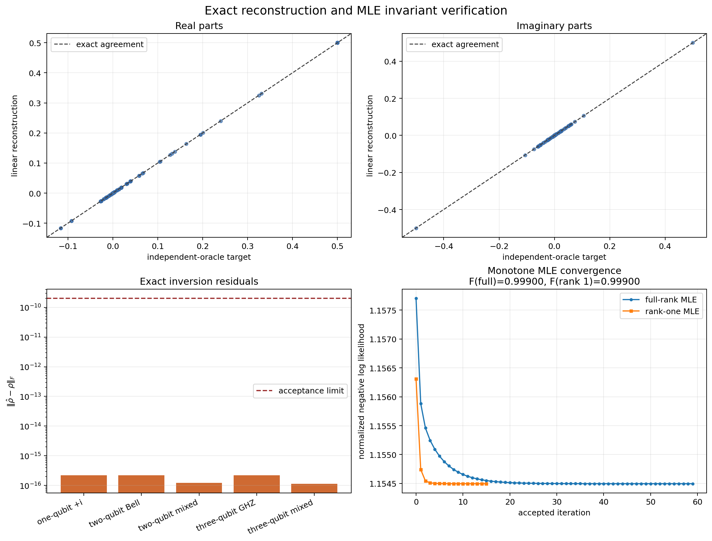
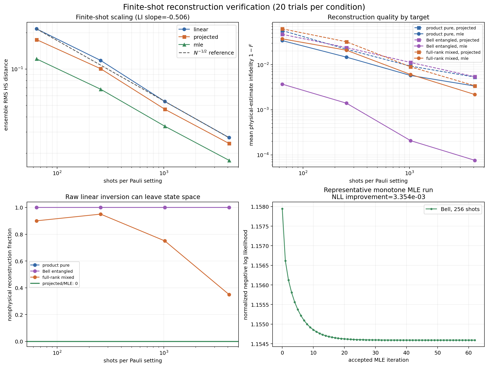

# Reconstruction verification

This directory verifies the reconstruction stage of the NBQST pipeline.  The
checks cover exact linear inversion, finite-shot accuracy, physicality,
factorized maximum-likelihood estimation (MLE), optimizer behavior, and
failure on informationally incomplete input.

The verification is split into two executable scripts.  Both scripts run all
numerical assertions before saving a figure, so a generated figure also means
that the corresponding acceptance checks passed.

## 1. Scope

The production reconstruction path contains three distinct operations:

1. raw Pauli linear inversion;
2. projection of the raw estimate onto the density-matrix state space; and
3. factorized multinomial MLE initialized from the projected estimate.

These operations have different contracts.  Linear inversion must be an
accurate, Hermitian, unit-trace estimator, but finite-shot linear inversion is
not guaranteed to be positive semidefinite.  Projection and MLE, in contrast,
must always return physical density matrices.  The verification therefore does
not apply fidelity to a raw, potentially nonphysical linear estimate.  Linear
inversion is evaluated with matrix norms and its nonphysical rate; fidelity is
reported only for projected and MLE estimates.

### 1.1 Package functions covered

The table lists only the package functions that are primary verification
targets. Input-construction helpers, data containers, and reporting metrics are
omitted.

| Package function under test | Behavior verified |
|---|---|
| `nbqst.reconstruction.linear_inversion_pauli` | Recovers one-, two-, and three-qubit pure and mixed states from an independent exact-data oracle, rejects informationally incomplete data, retains Hermiticity and unit trace under finite shots, and follows the expected inverse-square-root error scaling. |
| `nbqst.reconstruction.negative_log_likelihood` | Provides the directional central-difference reference used to validate the analytic likelihood gradient. |
| `nbqst.reconstruction._likelihood_gradient` | Its analytic directional derivative agrees with a central finite-difference derivative of `negative_log_likelihood`; the leading underscore denotes an internal function. |
| `nbqst.reconstruction.factorized_mle` | Full-rank and rank-one estimates remain physical, accepted iterations do not increase negative log likelihood, rank capping is respected, and finite-shot reconstruction quality improves with additional shots. |
| `nbqst.denoise.project_density_matrix` | Projected estimates are Hermitian, positive semidefinite, and unit trace across all finite-shot targets, shot counts, and trials. |

## 2. Files and reproducibility

- `exact_reconstruction_verification.py` constructs exact data with an
  independent tensor-product projector oracle and checks MLE invariants.
- `finite_shot_reconstruction_verification.py` runs repeated two-qubit
  multinomial experiments across four shot counts.
- `exact_reconstruction_verification.png` summarizes exact elementwise
  agreement, exact inversion residuals, and MLE convergence.
- `finite_shot_reconstruction_verification.png` summarizes statistical error
  scaling, infidelity, physicality, and a representative MLE trajectory.

Run the verification from the repository root:

```powershell
python verification/3_reconstruction/exact_reconstruction_verification.py
python verification/3_reconstruction/finite_shot_reconstruction_verification.py
```

The finite-shot ensemble size and seed are configurable:

```powershell
python verification/3_reconstruction/finite_shot_reconstruction_verification.py `
    --trials 40 --seed 20260830
```

The reference figures in this directory use 20 trials per target and shot
count with seed `20260830`.  There are three targets and four shot counts, for a
total of 240 reconstruction conditions and 720 method records.

## 3. Independent exact-data oracle

For a local Pauli setting

$$
s = s_1s_2\cdots s_n,\qquad s_q\in\{X,Y,Z\},
$$

and outcome bit string $b$, the validation oracle constructs the projector

$$
\Pi_{b|s}
=\bigotimes_{q=1}^{n}
\frac{I+(-1)^{b_q}\sigma_{s_q}}{2}
$$

and evaluates

$$
p(b|s)=\operatorname{Tr}(\rho\Pi_{b|s}).
$$

Deterministic probability-weighted counts are then supplied directly through
`MeasurementData`.  The oracle deliberately does not call the production
basis-rotation or exact-measurement functions.  This separation prevents a
shared qubit-ordering, outcome-bit, or Pauli-sign error from cancelling between
measurement generation and reconstruction.

The exact suite includes a complex one-qubit state, Bell and GHZ states, and
full-rank complex mixed states.  It covers one, two, and three qubits and all
$3^n$ local Pauli settings.

### Exact linear-inversion result

| Case | Frobenius error | Maximum element error |
|---|---:|---:|
| one-qubit $\lvert +i\rangle$ | $2.220\times10^{-16}$ | $1.110\times10^{-16}$ |
| two-qubit Bell | $2.220\times10^{-16}$ | $1.110\times10^{-16}$ |
| two-qubit mixed | $1.228\times10^{-16}$ | $5.551\times10^{-17}$ |
| three-qubit GHZ | $2.220\times10^{-16}$ | $1.110\times10^{-16}$ |
| three-qubit mixed | $1.152\times10^{-16}$ | $3.015\times10^{-17}$ |

All values are far below the acceptance threshold
$\|\hat\rho-\rho\|_F<2\times10^{-10}$.  Removing one required Pauli setting is
also checked and must raise `ValueError`.



The upper parity plots compare every real and imaginary density-matrix element
with the independent oracle target.  The lower-left panel shows the exact
inversion residuals on a logarithmic scale.  The lower-right panel shows that
every accepted full-rank and rank-one MLE update is non-increasing in normalized
negative log likelihood.

## 4. Likelihood and optimizer checks

For counts $n_{s,b}$, the MLE objective is the normalized multinomial negative
log likelihood

$$
\mathcal{L}(\rho)
=-\frac{1}{N_{\mathrm{total}}}
\sum_{s,b}n_{s,b}\log p(b|s).
$$

The factorization

$$
\rho(T)=\frac{T^\dagger T}{\operatorname{Tr}(T^\dagger T)}
$$

enforces Hermiticity, unit trace, and positive semidefiniteness.  The exact
verification checks the following optimizer invariants:

- an analytic likelihood directional derivative agrees with a two-sided
  central finite difference;
- every accepted MLE iteration is non-increasing in objective;
- the final objective is no greater than the projected initialization;
- full-rank and rank-one estimates are physical; and
- the rank-one result has numerical rank no greater than one.

For the reference run, the analytic and numerical directional derivatives were
`+1.9667303289e-01` and `+1.9667303286e-01`, respectively, giving relative
error `2.810e-11`.  On the finite-shot Bell fixture, full-rank MLE reduced NLL
from `1.157701643` to `1.154496455` and reached fidelity `0.99900190`.  Its
minimum eigenvalue was `-4.093e-17`, which is numerical roundoff around zero.

## 5. Finite-shot experimental design

The statistical verification uses fixed two-qubit targets from three state
families:

- a complex product pure state;
- a maximally entangled Bell state; and
- a reproducible full-rank complex mixed state.

For every target, independent complete local-Pauli datasets are sampled at 64,
256, 1,024, and 4,096 shots per setting.  Each dataset is reconstructed with
raw linear inversion, physical projection, and full-rank MLE.  Every projected
and MLE result is checked for

$$
\|\hat\rho-\hat\rho^\dagger\|_F<2\times10^{-10},\qquad
|\operatorname{Tr}(\hat\rho)-1|<2\times10^{-10},\qquad
\lambda_{\min}(\hat\rho)\ge -2\times10^{-10}.
$$

The statistical assertions compare ensemble summaries.  They do not require
every individual noisy realization to improve as shots increase, because such
a per-seed condition is not implied by multinomial sampling.

## 6. Finite-shot results

### Hilbert--Schmidt error scaling

| Shots per setting | Linear RMS | Projected RMS | MLE RMS |
|---:|---:|---:|---:|
| 64 | 0.21550 | 0.17551 | 0.12147 |
| 256 | 0.11784 | 0.10062 | 0.067998 |
| 1,024 | 0.053821 | 0.046392 | 0.033546 |
| 4,096 | 0.027007 | 0.024148 | 0.017496 |

The fitted raw linear-inversion slope is `-0.5060`, consistent with the
finite-shot law

$$
\operatorname{RMSE}(\hat\rho_{\mathrm{LI}})\propto N^{-1/2}.
$$

The assertion accepts slopes within `0.13` of `-0.5`.

### Physical-estimate infidelity

| Target | Estimator | Mean $1-F$ at 64 shots | Mean $1-F$ at 4,096 shots |
|---|---|---:|---:|
| product pure | projected | 0.057135 | 0.0053116 |
| product pure | MLE | 0.034144 | 0.0033628 |
| Bell entangled | projected | 0.047099 | 0.0054151 |
| Bell entangled | MLE | 0.0037022 | 0.000075922 |
| full-rank mixed | projected | 0.062291 | 0.0034079 |
| full-rank mixed | MLE | 0.037383 | 0.0021817 |

For every target and both physical estimators, the mean infidelity at the
largest shot count is lower than at the smallest shot count.



The lower-left panel illustrates why raw linear inversion and physical
estimators must be interpreted differently.  The two rank-deficient pure
targets produce a negative linear-inversion eigenvalue in every sampled trial,
even though their matrix error shrinks with shots.  The full-rank mixed target's
nonphysical fraction drops to `0.35` at 4,096 shots.  Projection and MLE have
zero nonphysical results in all reference conditions.  Across all runs, the
smallest projected/MLE eigenvalue is `-3.799e-16`, again consistent with
floating-point roundoff.

## 7. Acceptance criteria

The scripts fail before writing a figure if any of the following conditions is
violated:

| Check | Acceptance condition |
|---|---|
| exact linear inversion | Frobenius error $<2\times10^{-10}$ |
| incomplete Pauli input | raises `ValueError` |
| likelihood gradient | central-difference relative error $<2\times10^{-6}$ |
| projected/MLE physicality | Hermitian and trace residuals $<2\times10^{-10}$; minimum eigenvalue $\ge-2\times10^{-10}$ |
| MLE accepted history | each NLL value is no greater than the preceding value up to $2\times10^{-12}$ |
| MLE final objective | no greater than initialization up to $2\times10^{-12}$ |
| rank-one MLE | numerical rank $\le1$ |
| linear finite-shot scaling | fitted slope within `0.13` of `-0.5` |
| finite-shot quality | final-shot mean infidelity lower than first-shot mean for each target and physical estimator |

## 8. Interpretation and limitations

This verification establishes internal numerical consistency and the expected
finite-shot behavior for the NumPy backend.  It does not establish that every
finite-shot MLE run reaches a global optimum: the factorized parameterization
is non-convex in its factor even though the density-matrix likelihood problem
is convex.  A further high-assurance check could compare one- and two-qubit
results with an independent convex solver.

The repeated finite-shot experiment is restricted to two qubits so that it can
run quickly as a regular regression check.  The exact oracle covers up to three
qubits.  Larger-qubit runtime and memory scaling should be assessed separately,
because the number of local settings grows as $3^n$ and dense density matrices
grow as $4^n$ elements.

Backend parity is also outside the default scripts because JAX and CuPy are
optional dependencies.  When those backends are installed, identical saved
counts should be reconstructed on each backend and compared after transfer to
NumPy.  This avoids conflating backend RNG differences with reconstruction
differences.
