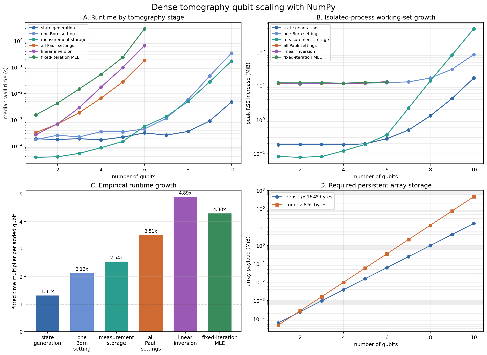

# Interpreting the Qubit-Count Scaling Verification

## 1. Purpose

This verification measures how the NumPy implementation changes as the number
of qubits increases.  It separates representation growth from complete
tomography computation through six stages:

1. dense Haar-state generation;
2. Born probabilities for one Pauli setting;
3. allocation of the complete measurement-count representation;
4. finite-shot simulation over all local-Pauli settings;
5. complete Pauli linear inversion; and
6. three iterations of rank-one factorized MLE.

State generation, one-setting probabilities, and measurement storage are
measured from one through ten qubits.  Full measurement, linear inversion, and
MLE are measured through six qubits because their complete-setting/operator
enumerations become the computational bottleneck before memory allocation does.

The executable evidence and generated artifacts are:

- `qubit_scaling_verification.py`
- `qubit_scaling_results.json`
- `qubit_scaling_verification.png`

## 2. Expected scaling

For (n) qubits, the Hilbert-space dimension is (d=2^n).  A dense
complex128 density matrix contains (d^2=4^n) entries and requires

\[
16\,4^n \text{ bytes}.
\]

Complete local-Pauli tomography uses (3^n) settings and (2^n) outcomes per
setting.  Storing one int64 count for every setting and outcome requires

\[
8\,3^n2^n=8\,6^n \text{ bytes}.
\]

At ten qubits these representations are:

| Quantity | Shape/count | Payload |
|---|---:|---:|
| Density matrix | (1024\times1024) complex128 | 16.000 MiB |
| Complete counts | 59,049 settings × 1,024 int64 outcomes | 461.320 MiB |

These are lower bounds.  The count dictionary also stores 59,049 strings,
NumPy array objects, hash-table entries, and allocator metadata.

The implementation constructs dense Kronecker-product operators.  A single
Born-probability calculation contains dense (d\times d) matrix products.
Applying it independently to all (3^n) settings has a pessimistic dense-work
estimate proportional to (3^n d^3=24^n).  Linear inversion visits (4^n)
Pauli strings and constructs a dense (d\times d) operator for each, giving
roughly (16^n) element work.  At ten qubits that would mean 59,049 complete
measurement settings and 1,048,576 Pauli strings.

## 3. Experimental design

The generated results use:

| Parameter | Value |
|---|---:|
| Implementation | NumPy 2.4.3 on CPU |
| Precision | float64 / complex128 |
| Representation and one-setting range | 1--10 qubits |
| Complete tomography range | 1--6 qubits |
| State family | Seeded dense Haar-random pure state |
| Shots per setting | 1,024 |
| Standard timed samples | 1 warm-up followed by 3 measurements |
| Nine/ten-qubit storage samples | no warm-up, 1 measurement |
| MLE configuration | rank 1, at most 3 accepted iterations |
| BLAS threads in workers | 1 |

The measurement-storage case creates the exact dictionary and int64 array
layout used by the simulator, initialized to zero, without paying the enormous
cost of calculating all Born probabilities.  It therefore gives a real RSS
measurement of the complete data representation rather than only plotting its
formula.

Every `(qubit count, stage)` case runs in a fresh subprocess.  The subprocess
records its baseline resident set size, performs setup and the benchmark, and
polls peak RSS every 2 ms.  The reported memory value is peak RSS minus the
process baseline.  Isolation prevents allocator state from one case affecting
later cases.

Setup inputs are constructed inside the monitored region but outside the timed
operation.  Consequently, runtime represents the named stage, while peak RSS
represents the complete working set needed to prepare and execute that stage.

## 4. Acceptance checks

Runtime and RSS values are descriptive and do not have hardware-independent
pass/fail thresholds.  The script instead asserts stable numerical and
structural properties:

- state and reconstruction shapes are (2^n\times2^n);
- output payload sizes exactly match the complex128 and int64 formulas;
- the storage test creates exactly (3^n) zero-initialized arrays;
- Born probabilities are nonnegative and normalized;
- every simulated setting contains exactly 1,024 shots;
- linear inversion is Hermitian with unit trace;
- MLE is Hermitian, positive semidefinite, and unit trace; and
- accepted MLE steps have non-increasing negative log likelihood.

All 48 measured cases passed these checks.

## 5. Runtime results

The largest representation and one-setting cases were:

| Ten-qubit stage | Median time |
|---|---:|
| State generation | 0.00480 s |
| One Born setting | 0.3434 s |
| Complete count-storage allocation | 0.1700 s |

The largest complete-tomography cases were:

| Six-qubit stage | Median time |
|---|---:|
| All 729 Pauli settings | 0.1821 s |
| Linear inversion | 0.6616 s |
| Three MLE iterations | 2.9145 s |

A least-squares fit of

\[
\log_2(t_n)=a+bn
\]

over each stage's measured range gives the fitted multiplier (2^b) per added
qubit:

| Stage | Measured range | Fitted multiplier |
|---|---:|---:|
| State generation | 1--10 | 1.31× |
| One Born setting | 1--10 | 2.13× |
| Measurement storage | 1--10 | 2.54× |
| All Pauli settings | 1--6 | 3.51× |
| Linear inversion | 1--6 | 4.89× |
| Fixed-iteration MLE | 1--6 | 4.30× |

Fixed costs dominate the smallest cases, so these fitted values are empirical
summaries rather than asymptotic complexity estimates.  They nevertheless show
the clear separation between representation work and complete tomography.

## 6. Memory results

The ten-qubit measurements expose the memory growth that was hidden at six
qubits:

| Ten-qubit stage | Persistent output | Peak RSS increase |
|---|---:|---:|
| State generation | 16.000 MiB | 17.21 MiB |
| One Born setting | 0.0078 MiB | 85.22 MiB |
| Complete measurement storage | 461.320 MiB | 494.24 MiB |

State generation stays close to its output size.  One Born setting returns only
an 8 KiB probability vector, but its dense (1024\times1024) unitary, rotated
state, and matrix-product workspace raise peak RSS by about 85 MiB.

The count-storage case is the most direct large-memory result.  Its array
payload is 461.32 MiB, while measured RSS rises by 494.24 MiB.  The additional
roughly 33 MiB comes primarily from the 59,049-key dictionary, strings, NumPy
array objects, and allocation overhead.

Complete-tomography cases at six qubits remain around 13 MiB of RSS increase
because their persistent mathematical payloads are still below 0.4 MiB and the
implementation processes settings or Pauli strings sequentially.  Their main
problem is runtime growth rather than simultaneous storage.

## 7. Reading the figure



- **Panel A** shows median wall time.  Representation and one-setting curves
  continue to ten qubits; complete-tomography curves stop at six.
- **Panel B** shows isolated-process peak working-set increases and the sharp
  (6^n) count-storage growth.
- **Panel C** summarizes fitted runtime multipliers over each available range.
- **Panel D** compares the exact (4^n) state and (6^n) count payloads.

## 8. Interpretation and limits

Ten qubits are entirely manageable for one dense state: the matrix occupies
only 16 MiB.  Complete local-Pauli data are substantially larger at about
461 MiB, and the actual Python representation reaches roughly 494 MiB above
baseline.  Thus count storage, not the density matrix, becomes the first clear
memory bottleneck in this design.

Computing those counts is a separate and harder problem.  The current simulator
would perform dense operations for each of 59,049 settings, while linear
inversion would construct and accumulate 1,048,576 Pauli strings.  The script
does not pretend that allocating the representation is equivalent to finishing
ten-qubit tomography; complete numerical stages remain explicitly capped at six
qubits.

Other limits are:

- timings describe this machine and software environment only;
- 2 ms RSS polling can miss very short-lived allocations;
- the MLE experiment measures three iterations, not time to convergence;
- only a dense Haar-pure target and complete Pauli representation are used;
- the fixed seed gives reproducibility but not an ensemble performance claim;
- BLAS is restricted to one thread to reduce timing variation; and
- storage allocation contains zero counts and does not simulate physical data.

## 9. Reproduction

From the repository root, run:

```powershell
python verification/5_qubit_scaling/qubit_scaling_verification.py
```

The important range controls are:

```powershell
python verification/5_qubit_scaling/qubit_scaling_verification.py `
  --max-qubits 10 --kernel-max-qubits 6 --mle-max-qubits 6
```

`--max-qubits` controls state, single-setting, and storage measurements.
`--kernel-max-qubits` controls full measurement and linear inversion.
`--mle-max-qubits` controls fixed-iteration MLE.

The default command overwrites the PNG and JSON with measurements from the
current machine.
