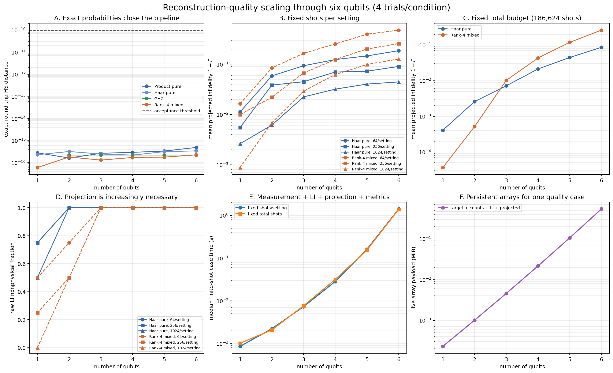

# Interpreting the Reconstruction-Quality Scaling Verification

## 1. Purpose

The runtime and storage scaling experiment shows when dense tomography becomes
expensive.  This companion verification asks the scientific question: as the
number of qubits grows, how accurately does the current NumPy reconstruction
recover the state?

The executable evidence and generated artifacts are:

- `reconstruction_quality_scaling_verification.py`
- `reconstruction_quality_scaling_results.json`
- `reconstruction_quality_scaling_verification.png`

The experiment runs through six qubits.  It uses complete local-Pauli
measurements, linear inversion, and exact positive-semidefinite unit-trace
projection.

## 2. Why two shot models are required

Complete local-Pauli tomography has (3^n) settings.  A statement such as
"1,024 shots" is ambiguous unless it specifies whether the number applies to
each setting or to the entire experiment.

### 2.1 Fixed shots per setting

The first model uses 64, 256, or 1,024 shots independently at every setting.
The total experimental budget is therefore

\[
N_{\mathrm{total}}=N_{\mathrm{per\ setting}}3^n.
\]

At six qubits, the three conditions use 46,656, 186,624, and 746,496 total
shots.  This model isolates how estimator quality changes with dimension while
keeping the information available at each setting constant.  It does not keep
the total experimental cost constant.

### 2.2 Fixed total shot budget

The second model fixes the complete experiment at 186,624 shots and divides
them evenly among all settings:

| Qubits | Settings | Shots per setting | Total shots |
|---:|---:|---:|---:|
| 1 | 3 | 62,208 | 186,624 |
| 2 | 9 | 20,736 | 186,624 |
| 3 | 27 | 6,912 | 186,624 |
| 4 | 81 | 2,304 | 186,624 |
| 5 | 243 | 768 | 186,624 |
| 6 | 729 | 256 | 186,624 |

This model is the more realistic comparison when the total measurement budget
is limited.  It combines increasing Hilbert-space dimension with decreasing
shots per setting.

## 3. Experimental design

The exact-probability closure test covers four state families:

- product pure;
- Haar-random pure;
- GHZ; and
- rank-controlled mixed states with rank at most four.

The repeated finite-shot experiment uses Haar pure and rank-4 mixed targets.
For each family and qubit count, one seeded target is held fixed while four
independent measurement realizations are sampled per condition.  This isolates
finite-shot variability from target-to-target variability.

The estimator sequence is:

```text
finite-shot complete Pauli data
→ linear inversion
→ exact PSD, trace-one projection
→ fidelity, HS distance, trace distance, purity, physicality
```

MLE is deliberately excluded from this scaling figure.  Comparing a fixed
iteration count would mix estimator quality with incomplete convergence, while
converging every six-qubit condition would materially increase the experiment
time.  Projected linear inversion supplies a deterministic, auditable baseline
for deciding whether a larger experiment is warranted.

## 4. Acceptance checks

The script asserts:

- exact-probability linear inversion closes the pipeline within
  (10^{-10}) Hilbert--Schmidt distance;
- every simulated setting contains exactly the requested shots;
- projected estimates are Hermitian, positive semidefinite, and unit trace;
- projected fidelity lies in the physical interval; and
- every saved array-payload value matches the arrays used by that case.

The maximum exact-closure error over all families and qubit counts was

\[
4.897\times10^{-16},
\]

well below the acceptance threshold.  Thus the finite-shot degradation is not
caused by an algebraic or qubit-ordering failure.

## 5. Six-qubit reconstruction quality

The six-qubit projected linear-inversion results are:

| Shot model | State | Shots/setting | Total shots | Mean fidelity | RMS HS distance |
|---|---|---:|---:|---:|---:|
| Fixed per setting | Haar pure | 64 | 46,656 | 0.8133 | 0.2627 |
| Fixed per setting | Haar pure | 256 | 186,624 | 0.9094 | 0.1319 |
| Fixed per setting | Haar pure | 1,024 | 746,496 | 0.9554 | 0.0680 |
| Fixed per setting | Rank-4 mixed | 64 | 46,656 | 0.5211 | 0.3468 |
| Fixed per setting | Rank-4 mixed | 256 | 186,624 | 0.7416 | 0.2067 |
| Fixed per setting | Rank-4 mixed | 1,024 | 746,496 | 0.8722 | 0.1087 |
| Fixed total budget | Haar pure | 256 | 186,624 | 0.9134 | 0.1277 |
| Fixed total budget | Rank-4 mixed | 256 | 186,624 | 0.7373 | 0.2051 |

Increasing shots improves both state families, but rank-4 mixed states are
consistently more difficult for spectral projection.  Projection truncates
negative eigenvalues and renormalizes the spectrum; this is particularly
distorting when the true state has several nonzero eigenvalues near the noise
floor.

At fixed 186,624 total shots, mean fidelity changes as follows:

| Qubits | Haar pure | Rank-4 mixed |
|---:|---:|---:|
| 1 | approximately 1.000 | approximately 1.000 |
| 2 | approximately 0.997 | approximately 0.999 |
| 3 | 0.993 | 0.990 |
| 4 | 0.980 | 0.957 |
| 5 | 0.957 | 0.883 |
| 6 | 0.913 | 0.737 |

The fixed-total-budget curve is the clearest evidence of statistical scaling:
the same number of experimental shots must estimate an exponentially growing
state description.

## 6. Physicality

Raw linear inversion becomes nonphysical rapidly.  For the tested Haar targets,
every raw reconstruction from two qubits onward had at least one negative
eigenvalue.  For rank-4 mixed targets, all tested raw reconstructions were
nonphysical from three qubits onward.  This happened even at 1,024 shots per
setting.

Nonphysicality does not mean that linear inversion is algebraically wrong.  It
is the expected consequence of unconstrained coefficient estimates under
finite sampling.  It does show that reporting fidelity directly on raw linear
inversion would be inappropriate; the physical projection is essential for the
quality comparison.

## 7. Runtime and memory of this experiment

The complete default experiment contains 23 exact cases, 192 finite-shot cases,
and 48 aggregated conditions.  On the measured machine it used:

| Resource | Observed value |
|---|---:|
| Total wall time | 61.94 s |
| Process baseline RSS | 72.68 MiB |
| Peak process RSS | 86.96 MiB |
| Peak RSS increase | 14.28 MiB |
| Six-qubit median case time | approximately 1.3--1.9 s |
| Six-qubit persistent array payload per case | approximately 0.54 MiB |

The modest memory use is consistent with the separate resource-scaling test:
at six qubits, the implementation processes operators sequentially and does not
retain all Pauli matrices simultaneously.  Runtime, rather than memory, is the
dominant constraint at this size.

## 8. Reading the figure



- **Panel A** demonstrates exact algebraic closure through six qubits.
- **Panel B** shows fidelity degradation at fixed shots per setting.
- **Panel C** shows the more demanding fixed-total-shot comparison.
- **Panel D** shows how often raw linear inversion leaves quantum state space.
- **Panel E** records complete finite-shot case time.
- **Panel F** records the persistent target, count, and estimate payload.

## 9. Implication for a ten-qubit quality run

The six-qubit quality suite is inexpensive in memory and completes in about one
minute.  This does not imply that the same complete-tomography experiment at ten
qubits is similarly practical:

- settings grow from 729 to 59,049;
- Pauli strings grow from 4,096 to 1,048,576;
- complete count storage grows from 0.356 MiB to 461.3 MiB; and
- the separate timing verification observed roughly 3.5--4.9× growth per added
  qubit for complete measurement and linear inversion.

A crude extrapolation from the measured slopes puts one ten-qubit quality case
in the several-minute range and the repeated 192-case design in the many-hour
range, with roughly 0.5 GiB or more of live process memory.  This is an
extrapolation, not a measured ten-qubit reconstruction.

The sensible next checkpoint is seven qubits with fewer trials or one selected
shot condition.  Jumping directly to the full ten-qubit ensemble would spend
substantial time confirming an already visible exponential limitation.

## 10. Reproduction

From the repository root, run:

```powershell
python verification/5_qubit_scaling/reconstruction_quality_scaling_verification.py
```

For a faster smoke run with fewer finite-shot repetitions:

```powershell
python verification/5_qubit_scaling/reconstruction_quality_scaling_verification.py `
  --trials 3
```

The default command overwrites the PNG and JSON with results from the current
machine.
