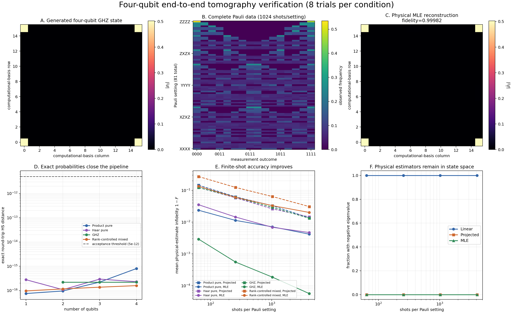

# Interpreting the End-to-End Pipeline Verification

## 1. Purpose and scope

This verification checks that the package components work correctly when they
are composed into the complete tomography workflow:

$$
\rho_{\mathrm{true}}
\xrightarrow{\text{local-Pauli measurement}}
\{n_{s,o}\}
\xrightarrow{\text{reconstruction}}
\hat\rho.
$$

The checks in `1_state_generation`, `2_measurement_simulation`, and
`3_reconstruction` isolate individual components. This directory instead tests
their interfaces and conventions together. It is therefore named
`4_end_to_end_pipeline` rather than `full_verification`: the latter could be
read as a claim that every package behavior, backend, and scale has been
exhaustively verified.

The verification has two layers:

1. **Exact round-trip closure** checks that probability-weighted Pauli data
   reproduce generated states at floating-point precision for one through four
   qubits.
2. **Repeated finite-shot tomography** checks four-qubit product, Haar, GHZ,
   and rank-controlled mixed states at several shot counts.

The main finite-shot experiment uses four qubits. This gives a nontrivial
$16\times16$ density matrix and all $3^4=81$ local-Pauli settings while keeping
repeated dense MLE runs practical on a CPU. A three-qubit example would be
faster, but its $8\times8$ state and 27 settings provide less convincing visual
evidence that the complete acquisition and reconstruction path is exercised.

### 1.1 Package functions exercised

| Pipeline stage | Production functions used |
|---|---|
| State generation | `random_product_state`, `haar_random_pure`, `ghz_state`, `random_mixed_state` |
| Measurement generation | `complete_pauli_settings`, `exact_pauli_measurements`, `simulate_pauli_measurements` |
| Reconstruction | `linear_inversion_pauli`, `project_density_matrix`, `factorized_mle` |
| Evaluation | `hilbert_schmidt_distance`, `fidelity` |

## 2. Running the verification

From the repository root, run:

```powershell
python verification\4_end_to_end_pipeline\end_to_end_verification.py
```

The default run uses eight independent finite-shot trials for every state
family and shot count. The repetition count and seed can be changed:

```powershell
python verification\4_end_to_end_pipeline\end_to_end_verification.py `
    --trials 16 `
    --seed 1234
```

The script creates:

- `end_to_end_verification.png`, the visual summary;
- `end_to_end_results.json`, the exact and finite-shot machine-readable data.

The default seed is fixed, and target-state RNG streams are separated from
measurement RNG streams. Changing the measurement loop order therefore does
not silently redefine the generated target states.

## 3. Experiment design

### 3.1 Exact closure

For each supported state family and each qubit count from one through four, the
script performs

```text
package state generator
    -> exact_pauli_measurements
    -> linear_inversion_pauli
    -> Hilbert-Schmidt comparison with the generated state
```

GHZ begins at two qubits, so there are 15 exact closure cases in total. Exact
probability-weighted counts contain no sampling noise. Failure at this stage
would therefore indicate an integration defect such as a Pauli-sign,
measurement-basis, outcome-order, qubit-order, or normalization mismatch.

Every exact case must satisfy

$$
\lVert\rho_{\mathrm{true}}-\hat\rho_{\mathrm{LI}}\rVert_{\mathrm{HS}}
<5\times10^{-12}.
$$

### 3.2 Four-qubit finite-shot tomography

One fixed package-generated target is used for each family:

- random product pure;
- global Haar-random pure;
- GHZ;
- rank-4 Ginibre/Wishart mixed.

For every target, the package samples all 81 Pauli settings using

$$
N\in\{64,256,1024,4096\}
$$

shots per setting and eight independent sampling seeds. This produces 128
measurement datasets. Each dataset is reconstructed by three methods, giving
384 estimate records:

1. raw Pauli linear inversion;
2. exact projection onto the density-matrix simplex;
3. factorized multinomial MLE initialized by the projected estimate.

The MLE is capped at 50 iterations so that the four-qubit ensemble remains a
practical regression experiment. This verification requires every accepted
MLE step to be non-increasing in negative log-likelihood; it does not claim
that every run has reached the global optimum or a strict convergence
tolerance within 50 iterations.

### 3.3 Numerical assertions

Before the figure is saved, the script checks that:

- every generated target is Hermitian, positive semidefinite, and trace one;
- every dataset contains exactly 81 settings and conserves the requested shots
  separately in every setting;
- exact round-trip error stays below the stated tolerance;
- linear inversion remains Hermitian and trace one;
- projected and MLE estimates remain positive semidefinite and trace one;
- accepted MLE iterations never increase the multinomial objective;
- aggregate projected and MLE infidelity improves between the lowest and
  highest shot counts.

## 4. Interpreting the figure



### 4.1 Panels A-C: one visible complete pipeline

Panels A-C show one four-qubit GHZ trial from beginning to end.

- **A** displays the magnitude of the package-generated target density matrix.
  The four bright corner elements are the two populations and two coherences
  of $(|0000\rangle+|1111\rangle)/\sqrt2$.
- **B** displays the observed frequencies for all 81 Pauli settings and 16
  outcomes at 1,024 shots per setting. This is sampled count data, not exact
  Born probabilities.
- **C** displays the physical MLE reconstruction from those counts on the same
  density-matrix color scale as panel A. Its fidelity with the generated target
  is 0.999824.

The matched matrix color limits are important: the visual agreement is not
created by independently rescaling the target and estimate.

### 4.2 Panel D: exact probabilities close the pipeline

All 15 exact state-to-measurement-to-reconstruction cases lie near machine
precision. The largest Hilbert-Schmidt error is

$$
8.05\times10^{-16},
$$

more than three orders of magnitude below the conservative
$5\times10^{-12}$ acceptance threshold. This is direct evidence that the
generation, measurement, and linear-inversion conventions agree through four
qubits.

### 4.3 Panel E: finite-shot accuracy improves

Panel E reports mean infidelity for the two physical estimators. Solid circles
are MLE results; dashed squares are projected linear-inversion results. Color
identifies the target family.

The default mean MLE infidelities change as follows:

| Four-qubit target | 64 shots/setting | 4,096 shots/setting |
|---|---:|---:|
| Product pure | $2.37\times10^{-2}$ | $4.19\times10^{-3}$ |
| Haar pure | $3.54\times10^{-2}$ | $4.71\times10^{-3}$ |
| GHZ | $2.92\times10^{-3}$ | $5.67\times10^{-5}$ |
| Rank-4 mixed | $1.35\times10^{-1}$ | $2.03\times10^{-2}$ |

All four MLE curves improve from the lowest to the highest shot count. The
mixed target is more difficult for the 50-iteration factorized optimizer than
the structured pure targets, so these curves should be read as the behavior of
the complete default experiment rather than as an optimizer-independent sample
complexity theorem.

### 4.4 Panel F: physical reconstruction

Raw linear inversion had a negative eigenvalue below $-10^{-10}$ in every
four-qubit finite-shot dataset. This is not a failure of the Pauli inversion
formula: unconstrained finite-sample fluctuations routinely move a linear
estimate outside the positive-semidefinite state space, and the effect becomes
easy to see in dimension 16.

All 128 projected estimates and all 128 MLE estimates were physical within the
same tolerance. Panel F therefore demonstrates that the package's physicality
operations have a substantive effect rather than merely changing an already
physical answer.

Fidelity is intentionally reported only for the projected and MLE estimates.
Squared Uhlmann fidelity assumes physical density matrices, so applying it to
the non-positive raw linear estimates would obscure this distinction.

## 5. What this establishes

The default run establishes the following bounded claim:

> The package-generated state families, complete local-Pauli measurement data,
> and three reconstruction paths interoperate correctly through four qubits;
> exact data close at floating-point precision, finite-shot physical estimates
> improve with sampling, and the constrained estimators remain valid density
> matrices.

This is automated integration evidence, not exhaustive verification of every
backend, optimizer setting, noise model, denoiser, or large-system scaling
claim. GPU parity and statistically precise confidence intervals require
separate experiments, and scientific conclusions still require independent
human review.
