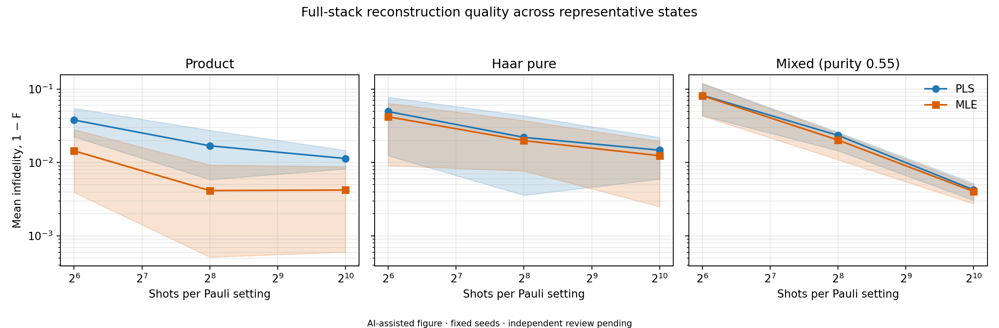
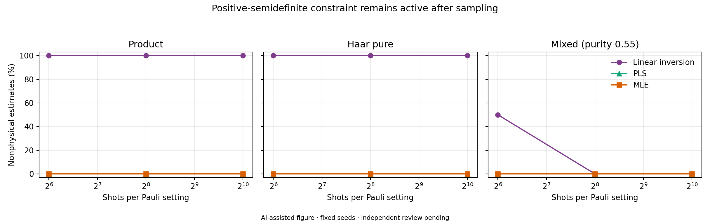
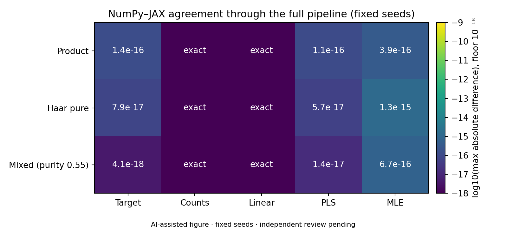

# Full-Stack Validation and Challenge-Gap Audit

**Project:** Hardware-Agnostic Quantum State Tomography Suite  
**Audit date:** 17 August 2026  
**Environment:** Python 3.13.14, NumPy 2.4.3, JAX 0.11.0 with x64 enabled,
Windows 11, JAX CPU device

> **Mandatory AI disclosure and validation status**  
> OpenAI Codex assisted with the audit design, adversarial tests, code changes,
> experiment script, figures, and this report. The reported commands were run
> locally with fixed seeds and the machine-readable results are included in the
> repository. This is automated validation evidence, not independent review.
> The project and this report must not be labelled **verified** until a human
> reviewer independently checks the physics, code, tests, and numerical claims.

## 1. Outcome

The implemented small-system QST pipeline works end to end on the two locally
available Array API backends, NumPy and JAX. The final automated suite contains
75 tests and covers state generation, finite-shot X/Y/Z measurement, linear
inversion, projected least squares (PLS), multinomial maximum-likelihood
estimation (MLE), metrics, backend agreement, and complete pipelines for
product, Haar-pure, and mixed targets.

One scientifically important defect was found and fixed. The measurement API
previously accepted non-finite, non-Hermitian, and non-positive-semidefinite
trace-one matrices. A `NaN` matrix could therefore produce an all-zero outcome
array instead of failing. All public measurement paths now require a finite,
Hermitian, positive-semidefinite, trace-one density matrix before evaluating
Born probabilities. The audit also fixed acceptance of Boolean qubit counts and
added asymmetric qubit-order and generic Born-rule regressions.

The core challenge is met for exhaustive **small-system** tomography, subject
to the qualifications in Section 8. The repository now includes an installable
`pyproject.toml`, unified `nbqs_qst` API, high-level pipeline, optional
dependency groups, and an executed example notebook. It is not a complete
hardware-benchmarking package: no GPU backend was installed, CuPy and PyTorch
were not exercised, dense tomography does not scale to 20 qubits, and
independent human review remains pending.

## 2. Audit method

The review used four layers:

1. a static comparison of `challenge_goal_document.md`, `AGENTS.md`, public
   APIs, core imports, randomness, precision, and companion documentation;
2. the original 55-test baseline suite;
3. adversarial checks for malformed states, asymmetric Y/bit-order cases,
   incomplete integration coverage, physicality, and backend reproducibility;
4. fixed-seed full-stack experiments across state families, shot counts, and
   reconstruction methods, with machine-readable JSON and rendered figures.

The folder was not a Git repository at audit time, so no historical diff or
commit-based provenance could be established. Existing files were preserved
and the audit additions are listed in Section 9.

## 3. Final automated test inventory

| Area | Collected tests | Principal coverage |
|---|---:|---|
| State generation | 30 | Product/Haar/mixed/controlled-purity/GHZ/W states, physicality, rank, purity, metrics, 1–6 qubits, seed and backend agreement |
| Measurement generation | 17 | Exact Born values, `|+y>` sign, all two-qubit Paulis, i.i.d. shot scaling, dataset aggregation, physical input rejection, MSB and lexicographic order, backend seed agreement |
| State reconstruction | 14 | Linear inversion, PLS projection, multinomial MLE, likelihood gradient, 1/√N error scaling, metrics, Bell and four-qubit GHZ reconstruction, NumPy/JAX agreement |
| Full stack, package, notebook, and static contracts | 14 | Three target families through generation → measurement → LI/PLS/MLE; unified API; executed notebook outputs; NumPy/JAX equality; no direct backend imports/RNG; companion files and AI disclosure |
| **Total** | **75** | Final command: `python -m pytest -q` |

The final clean run result is recorded in Section 10.

## 4. Defect found and corrected

### 4.1 Invalid density matrices reached the sampler

Before correction, all three examples below were accepted because only shape
and trace were checked:

- a matrix containing `NaN` values;
- a non-Hermitian trace-one matrix;
- `diag(1.2, -0.2)`, which has a negative eigenvalue.

The `NaN` case emitted a divide warning and returned outcome zero for every
shot. The negative-eigenvalue case was silently altered by probability clipping
and renormalization. Neither behavior represents Born-rule sampling of a
physical state.

The shared measurement validator now checks, using only the detected Array API
namespace:

- finite entries;
- real unit trace within `1e-10`;
- Hermiticity within `1e-10`;
- minimum Hermitian eigenvalue no lower than `-1e-10`.

This eigenspectrum check runs once per public measurement call. Its cost is
acceptable in this exhaustive implementation because a complete experiment
already performs dense basis rotations over all `3^n` settings. Regression
tests now require all three malformed states to fail clearly.

### 4.2 Additional missed contracts

The original tests did not fully disambiguate qubit order, Pauli ordering, or a
generic complex two-qubit Born trace. The added regressions establish that:

- `|01>` measured in `ZZ` always returns integer outcome `1`, so qubit 0 is the
  most significant bit;
- `ZI=+1` and `IZ=-1` for the same asymmetric state;
- Pauli labels and matrices use `I < X < Y < Z` lexicographic order;
- all 16 two-qubit exact expectations match direct `Tr(P rho)` calculations;
- `True` is not accepted as a one-qubit count;
- the complete fixed-seed NumPy and JAX pipelines agree for three target
  families and all three reconstruction methods.

## 5. Full-stack experiment

The reproducible experiment uses two-qubit product, Haar-random pure, and
purity-0.55 mixed states. For each family and each of 64, 256, and 1,024 shots
per Pauli setting, 12 fixed sampling seeds were evaluated. Fidelity is reported
only for PLS and MLE because squared Uhlmann fidelity is defined for physical
density matrices; linear inversion is assessed for trace, Hermiticity, and
positive semidefiniteness instead.



Mean fidelity improved with sampling for most cases. At 1,024 shots per
setting, mean PLS/MLE fidelities were `0.98866/0.99578` for the product target,
`0.98528/0.98762` for the Haar target, and `0.99576/0.99597` for the mixed
target. The small product-state MLE plateau between 256 and 1,024 shots is within
the broad 12-seed empirical spread and should not be treated as a resolved
sample-complexity trend.



All 216 PLS/MLE estimates were positive semidefinite within the `1e-10` audit
tolerance. Linear inversion was nonphysical in all 72 pure-target cases and in
6 of 36 mixed-target cases, or 78 of 108 linear estimates overall. This is the
expected finite-shot limitation of unconstrained linear inversion and confirms
that PLS/MLE physicality constraints are operational rather than cosmetic.

### MLE convergence qualification

MLE reported convergence in 106 of 108 runs. Two product-state runs at 1,024
shots reached the default 500-iteration limit. They remained physical and had
fidelities `0.99874` and `0.98945`; their final normalized objective decreases
were still approximately `10^-9` to `2×10^-8` per accepted step. This indicates
slow projected-gradient convergence near a boundary optimum, not a physicality
failure. Nevertheless, default MLE convergence is not universal in the tested
grid. A production study should expose optimizer diagnostics, increase the
iteration budget when required, and/or evaluate an accelerated or factorized
MLE solver.

## 6. Backend and reproducibility evidence

The same fixed seeds were run through state generation, measurement, and all
three reconstruction methods on NumPy and JAX. JAX 64-bit mode was enabled
before arrays were created.



Counts and linear-inversion matrices were exactly equal. Across target states,
PLS, and MLE, the largest absolute matrix-element difference was
`1.33×10^-15`. This supports deterministic stdlib-RNG behavior and numerical
agreement on the two installed CPU backends. It does **not** establish GPU
performance or compatibility with uninstalled CuPy/PyTorch versions.

## 7. Challenge compliance matrix

| Challenge item | Audit status | Evidence and qualification |
|---|---|---|
| Product, Haar-pure, and random mixed states | Met | Physicality, rank, ensemble-purity, exact-purity, structured-state, and 1–6 qubit tests |
| X/Y/Z measurements over `3^n` settings | Met for small systems | Exact Born tests, raw i.i.d. outcomes, multinomial counts, no Gaussian layer |
| Y-transpose sign and ordering rules | Met | `|+y>` regression, all-Pauli direct trace check, `|01>` MSB test, lexicographic labels/matrices |
| Reproducible stdlib randomness | Met on installed backends | Fixed seeds give identical counts on NumPy/JAX; static core audit finds no direct backend RNG |
| Array API core with no direct NumPy import | Met statically | All three core modules use `array_namespace`; no NumPy/CuPy/JAX/PyTorch core import |
| `complex128`, including JAX x64 | Met on NumPy/JAX | State and reconstruction dtype tests; `jax_enable_x64=True` in backend tests/experiments |
| Linear inversion | Met | Count-based Pauli inversion, known nonphysical finite-shot regression |
| Physical MLE | Met with convergence caveat | Exact multinomial objective and projected-gradient PSD/trace-one constraint; 106/108 convergence in audit grid |
| At least two backends | Met locally | NumPy and JAX CPU full-stack execution; CuPy, PyTorch, and GPU untested |
| Reproducible markdown/notebook demonstration | Met | Executed `examples/complete_qst_pipeline.ipynb`, this report, fixed seeds, JSON, PNG, and PDF outputs |
| Quality/performance analysis | Partially met | Fidelity/physicality and local CPU timing data exist; no portable GPU benchmark |
| Modular object-oriented package | Met for the functional Array API design | Installable `nbqs-qst` distribution, unified namespace, immutable state/dataset/result/run records, and pure numerical functions |
| `n=3…20` CPU/GPU MLE exploration | Not met; open-ended | Exhaustive dense matrices and `3^n` settings make this implementation unsuitable for `n=20` |
| Classical shadows | Not implemented; stretch goal | No reduced-measurement protocol is present |
| AI disclosure plus independent validation | Disclosure met; review pending | AI notices are present, but this automated audit is not independent human validation |

## 8. Remaining risks and submission gaps

1. **No GPU evidence.** JAX reported only `cpu:0`; CuPy and PyTorch were not
   installed. Claims should be limited to API design and NumPy/JAX CPU evidence.
2. **Dense exponential scaling.** Materializing dense Pauli operators and
   visiting every setting prevents full tomography near 20 qubits. GPU transfer
   alone cannot fix the memory and measurement-complexity growth.
3. **Optimizer robustness.** Two high-shot product runs did not satisfy the
   default convergence criterion within 500 iterations.
4. **Environment locking.** `pyproject.toml` defines minimum dependencies and
   optional `test`/`example` groups, but it intentionally does not pin a single
   platform-specific lock file. Publication or deployment should record the
   resolved environment alongside results.
5. **Limited statistical scope.** Twelve fixed seeds per point are sufficient
   for regression evidence, not for publication-grade confidence intervals or
   a defensible 99%-fidelity shot threshold.
6. **Mutable array payloads.** Result dataclasses are frozen, but their array
   members can still be mutable on NumPy. Callers should treat returned objects
   as immutable records.
7. **Independent review pending.** Physics derivations, tolerances, optimizer
   behavior, and generated prose/figures still require human review.

## 9. Audit additions and reproducible artifacts

The audit added or changed:

- `src/nbqs_qst/measurement_generation/pauli_measurement.py`: physical input validation,
  Boolean qubit rejection, and AI disclosure;
- its adjacent `pauli_measurement.md`: updated validation contract;
- `tests/test_measurement.py`: adversarial state,
  generic Born-rule, MSB, and ordering tests;
- `tests/test_full_stack.py`: three-family NumPy/JAX end-to-end and
  static core-contract tests;
- `src/nbqs_qst/`: unified public API and immutable `TomographyRun` pipeline;
- `pyproject.toml`: installable distribution metadata and dependency extras;
- `examples/complete_qst_pipeline.ipynb`: executed standalone demonstration;
- `dist/nbqs_qst-0.1.0-py3-none-any.whl`: inspected wheel containing only the
  four public packages and their companion documentation;
- package and notebook regression tests in `tests/`;
- `tests/generate_validation_figures.py` and its companion markdown;
- `docs/validation_artifacts/`: JSON plus PNG/PDF outputs;
- this English audit report.

Machine-readable results are in
[`full_stack_validation_data.json`](validation_artifacts/full_stack_validation_data.json).

## 10. Reproduction and final run

From the project root:

```powershell
# Required because the pytest console script is not on PATH in this environment
python -m pytest -q

# Recreate the fixed-seed JSON and figures
python tests/generate_validation_figures.py

# Build the wheel
python -m pip wheel . --no-deps --wheel-dir dist
```

Final clean suite result after all changes:

```text
75 passed in 23.95s
```

The numerical evidence and figures were generated successfully, visually
inspected for legibility, and cross-checked against the JSON summaries. Under
the mandatory disclosure rule, their status remains **automated validation
passed; independent review pending**.
