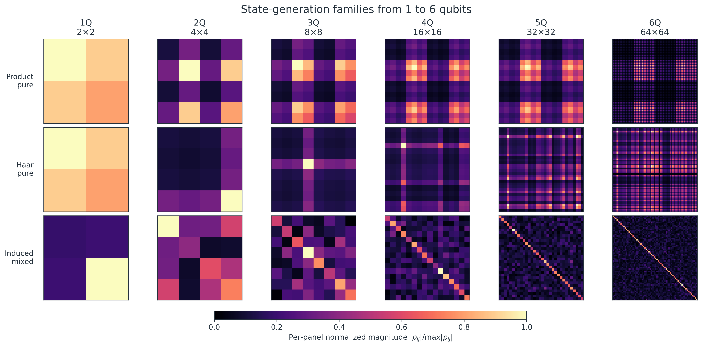
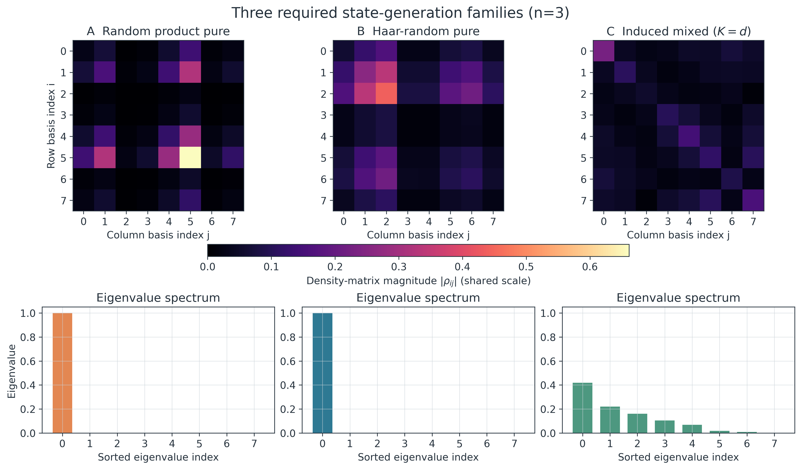
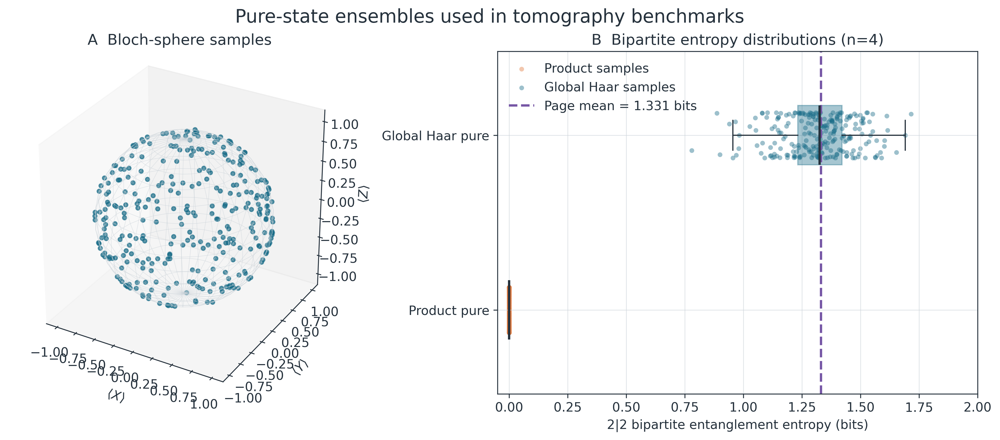
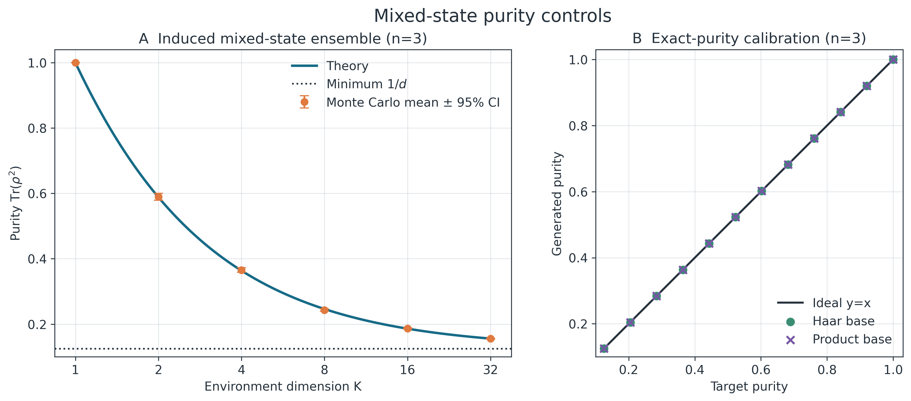

# State Generation for Hardware-Agnostic Quantum State Tomography

## 1. Scope and challenge alignment

Quantum state tomography (QST) begins with reproducible target states whose
physical structure is known. The current implementation covers all three state
families required by the challenge:

1. random product pure states;
2. Haar-random pure states;
3. random mixed states with variable rank and purity.

It also provides exact-target-purity states and deterministic GHZ and W
reference states. Every generator returns a density matrix that can be passed
directly to the Pauli measurement simulator.

Related files:

- implementation: [`state_generation.py`](../../src/nbqs_qst/state_generation/state_generation.py)
- API and method notes: [`state_generation.md`](../../src/nbqs_qst/state_generation/state_generation.md)
- extended literature notes: [`theory_notes.md`](../../src/nbqs_qst/state_generation/theory_notes.md)
- tests: [`test_state_generation.py`](../../tests/test_state_generation.py)
- figure generator: [`generate_state_generation_figures.py`](../../tests/analysis/generate_state_generation_figures.py)

## 2. Mathematical setting

An $n$-qubit Hilbert space has dimension $d=2^n$. A valid density matrix must
satisfy

$$
\rho=\rho^\dagger,\qquad \rho\succeq0,\qquad \operatorname{Tr}(\rho)=1.
$$

A pure state $|\psi\rangle$ is represented as
$\rho=|\psi\rangle\langle\psi|$. Its mixedness is characterized by the purity

$$
\gamma=\operatorname{Tr}(\rho^2),
\qquad \frac{1}{d}\leq\gamma\leq1.
$$

Pure states have $\gamma=1$, while the maximally mixed state has
$\gamma=1/d$. Reconstruction quality follows the challenge definitions:

$$
F(\rho,\sigma)
=\left(\operatorname{Tr}\sqrt{\sqrt\rho\,\sigma\sqrt\rho}\right)^2,
\qquad
O(\psi,\hat\psi)=|\langle\psi|\hat\psi\rangle|^2.
$$

## 3. State-generation methods

### 3.1 Random product pure states

For each qubit, two independent complex Gaussian values are drawn and
normalized:

$$
|\psi_j\rangle
=\frac{(g_{j0},g_{j1})^T}{\sqrt{|g_{j0}|^2+|g_{j1}|^2}}.
$$

The global state is

$$
|\Psi\rangle=\bigotimes_{j=0}^{n-1}|\psi_j\rangle.
$$

Each local factor is uniformly distributed on the Bloch sphere, but the global
state is separable. It therefore has unit purity and zero entanglement entropy
across every bipartition. Qubit 0 is the most significant bit in both the tensor
product and the computational-basis index.

### 3.2 Haar-random pure states

Let $z\in\mathbb C^d$ have independent complex Gaussian components. Then

$$
|\psi\rangle=\frac{z}{\sqrt{z^\dagger z}}
$$

is Haar-distributed. The isotropic Gaussian direction is invariant under fixed
unitary transformations, so a full random unitary does not need to be
constructed. Haar states and product states both have purity one, but
many-qubit Haar states are typically highly entangled. Comparing these two
families isolates state structure from purity.

### 3.3 Induced Ginibre/Wishart mixed states

Let $G\in\mathbb C^{d\times K}$ be a complex Ginibre matrix. The construction

$$
W=GG^\dagger,
\qquad
\rho=\frac{W}{\operatorname{Tr}(W)}
$$

produces a Hermitian, positive-semidefinite, trace-one state. Its rank is almost
surely $\min(d,K)$, and its ensemble-mean purity is

$$
\mathbb E\!\left[\operatorname{Tr}(\rho^2)\right]
=\frac{d+K}{dK+1}.
$$

$K=1$ gives the rank-one Haar ensemble, while $K=d$ gives the
Hilbert--Schmidt random-state ensemble. Increasing $K$ concentrates the
eigenvalues near $1/d$. The parameter $K$ controls a distribution of purities;
it does not fix the purity of an individual sample.

### 3.4 Exact-target-purity states

When purity must be swept as an exact independent variable, a pure state is
mixed with the identity:

$$
\rho_\alpha
=\alpha|\psi\rangle\langle\psi|+(1-\alpha)\frac{I}{d},
\qquad
\alpha=\sqrt{\frac{\gamma-1/d}{1-1/d}}.
$$

This construction attains the requested $\gamma$ analytically. It is a useful
purity-controlled benchmark, but it is not a uniform distribution over the
fixed-purity surface and should not automatically be interpreted as a physical
device-noise channel.

### 3.5 Structured reference states

The deterministic reference families are

$$
|\mathrm{GHZ}_n\rangle
=\frac{|0\rangle^{\otimes n}+|1\rangle^{\otimes n}}{\sqrt2},
\qquad
|W_n\rangle
=\frac{1}{\sqrt n}\sum_{j=0}^{n-1}|0\cdots010\cdots0\rangle.
$$

Their known amplitude locations and distinct multipartite-entanglement
structures make them useful convention checks and end-to-end regression cases.

## 4. Hardware-agnostic implementation

- The core module does not import NumPy. It detects the array namespace from a
  prototype `like` array.
- Returned kets and density matrices use `complex128`. JAX requires
  `jax_enable_x64=True` before arrays are created.
- No in-place array updates are used, preserving compatibility with immutable
  JAX arrays.
- The only random source is `random.Random(seed)`; backend random-number
  generators are never called.
- A fixed seed generates the same ordered Gaussian draws on every backend.
- `GeneratedState` is a frozen record containing `rho`, an optional `ket`, the
  family, qubit count, seed, and generation parameters.

## 5. Results and figures

The figures contain titles, axes, legends, color scales, and theoretical
reference curves required to interpret the data. Detailed derivations,
experimental settings, and discussion are kept in this report rather than
inside the figures.

### 5.1 State families from 1 to 6 qubits



Columns span 1Q through 6Q. Rows show product pure, Haar pure, and induced mixed
states with $K=d$. A common seed of 29 is used across dimensions. Each matrix
magnitude is normalized by its own maximum so that internal structure remains
visible as dimension grows; colors must therefore not be compared as absolute
matrix-element values between panels.

The induced mixed-state sample purities from 1Q to 6Q are 0.7924, 0.4818,
0.2388, 0.1211, 0.0612, and 0.0311. This is consistent with the decreasing
ensemble-mean purity expected for $K=d$ as the dimension increases.

| Qubits $n$ | Dimension $d$ | Density-matrix shape | Pauli settings $3^n$ |
|---:|---:|---:|---:|
| 1 | 2 | $2\times2$ | 3 |
| 2 | 4 | $4\times4$ | 9 |
| 3 | 8 | $8\times8$ | 27 |
| 4 | 16 | $16\times16$ | 81 |
| 5 | 32 | $32\times32$ | 243 |
| 6 | 64 | $64\times64$ | 729 |

A 6Q density matrix contains 4096 complex entries and remains easy to generate
and visualize. Exhaustive $X/Y/Z$ tomography already requires 729 measurement
settings, so state-visualization cost and full-tomography cost must be treated
separately.

### 5.2 The three required generation families



For 3Q states generated with seed 71, the upper row shows density-matrix
magnitudes and the lower row shows sorted eigenvalue spectra. All density
matrices use the same color scale.

| Family | Rank | Purity | $S(\rho)$ (bits) | $S(\rho_{q0})$ (bits) |
|---|---:|---:|---:|---:|
| Product pure | 1 | 1.0000 | 0.0000 | 0.0000 |
| Haar pure | 1 | 1.0000 | 0.0000 | 0.7198 |
| Induced mixed $(K=8)$ | 8 | 0.2657 | 2.2045 | 0.9873 |

The product and Haar samples have the same rank and purity, but differ in the
entropy of the qubit-0 reduced state. For a globally pure state, this reduced
entropy is the bipartite entanglement entropy. The same quantity is not, by
itself, an entanglement measure when the global state is mixed.

### 5.3 Pure-state ensemble structure



The left panel contains 320 independently seeded 1Q Haar Bloch vectors. Their
coverage of the sphere visually checks the direction-uniform local-state
generator used by the product family.

The right panel compares $2|2$ bipartite entanglement entropy for 240 product
states and 240 global Haar states at 4Q. Product states concentrate at zero,
while Haar states occupy the high-entropy region. The dashed theoretical
reference is Page's mean for a $4\times4$ bipartition, approximately 1.3307
bits.

### 5.4 Mixed-state purity controls



The left panel uses $d=8$ and
$K\in\{1,2,4,8,16,32\}$. Each point is the mean of 120 generated states and
the error bar is a 95% confidence interval for the state-to-state mean. The
solid curve is the induced-ensemble theoretical prediction
$(d+K)/(dK+1)$; the dotted line is the physical minimum $1/d$.

The right panel calibrates the exact-purity generator with Haar and product
base states. The diagonal is the theoretical $y=x$ reference. Across 12 target
purities in $[1/d,1]$, the maximum observed absolute error is
$5.6\times10^{-16}$, at the scale of double-precision rounding.

## 6. Measurement and reconstruction interface

Each generated density matrix is passed to the measurement module, which uses
the Born probability

$$
p_k=\operatorname{Tr}(E_k\rho)
$$

for each Pauli setting and outcome element. Measurement noise consists only of
finite-shot multinomial sampling from this exact distribution; no Gaussian
noise is added.

State and measurement seeds should remain separate. This allows target-to-target
variation to be distinguished from finite-shot noise. A useful reconstruction
study can then:

1. compare product and Haar states at fixed $n$, purity, and shot count;
2. vary $K$ while recording both actual rank and sample purity;
3. sweep exact target purity $\gamma$ independently;
4. repeat every condition over independent state and measurement seeds;
5. report overlap for pure targets and squared Uhlmann fidelity for general
   targets, including uncertainty rather than only the mean.

## 7. Automated validation

As of 2026-08-17, the complete test suite reports **55 passed**. State-generation
coverage includes:

- shape, `complex128`, Hermiticity, trace one, and positive semidefiniteness;
- unit purity and ket normalization for pure families;
- induced-state rank and ensemble-mean purity;
- exact requested purity;
- GHZ/W basis ordering and the qubit-0 most-significant-bit convention;
- fixed-seed reproducibility and agreement across at least two installed
  backends;
- fixed-seed agreement through the measurement pipeline;
- absence of NumPy imports and backend RNG calls in the core module;
- physicality of all three required families at 6Q ($64\times64$).

Automated tests do not replace scientific review. The Monte Carlo checks use a
finite number of samples, and the visual distribution checks are not formal
goodness-of-fit tests. Dense density matrices and the $3^n$ Pauli-setting count
also scale exponentially, so the 6Q demonstration does not establish the
scalability of dense full tomography to large $n$.

## 8. Reproduction

Run the following commands from the repository root:

```bash
python tests/analysis/generate_state_generation_figures.py
python -m pytest -q
```

The plotting script writes 300-dpi PNG and vector PDF versions to
[`docs/figures/state_generation/`](../figures/state_generation/). PDF is preferable for
poster assembly because text and lines remain vector graphics.

## 9. References

1. K. Życzkowski and H.-J. Sommers, *Induced measures in the space of mixed
   quantum states*, J. Phys. A 34, 7111 (2001).
   [arXiv](https://arxiv.org/abs/quant-ph/0012101) ·
   [DOI](https://doi.org/10.1088/0305-4470/34/35/335)
2. F. Mezzadri, *How to generate random matrices from the classical compact
   groups*, Notices of the AMS 54, 592 (2007).
   [arXiv](https://arxiv.org/abs/math-ph/0609050)
3. D. N. Page, *Average Entropy of a Subsystem*, Phys. Rev. Lett. 71,
   1291 (1993). [arXiv](https://arxiv.org/abs/gr-qc/9305007)
4. D. Gross et al., *Quantum state tomography via compressed sensing*,
   Phys. Rev. Lett. 105, 150401 (2010).
   [arXiv](https://arxiv.org/abs/0909.3304)
5. J. Haah et al., *Sample-optimal tomography of quantum states*, IEEE Trans.
   Inf. Theory 63, 5628 (2017).
   [arXiv](https://arxiv.org/abs/1508.01797)
6. W. Dür, G. Vidal, and J. I. Cirac, *Three qubits can be entangled in two
   inequivalent ways*, Phys. Rev. A 62, 062314 (2000).
   [arXiv](https://arxiv.org/abs/quant-ph/0005115)

## 10. Required disclosure and review status

This report, the associated code, equations, and figures were prepared with
OpenAI Codex assistance. They remain **UNVERIFIED** until independently reviewed
and validated, as required by the challenge rules.
