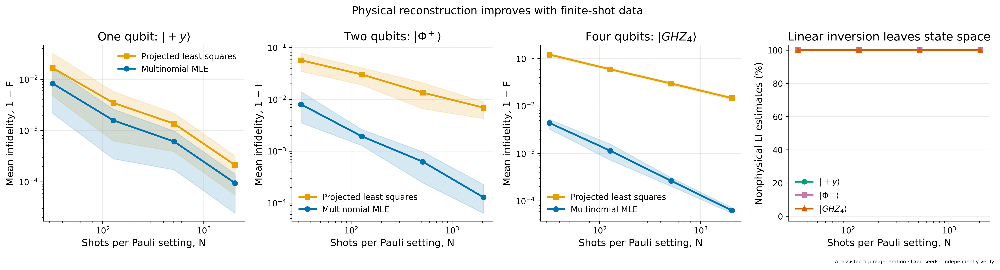
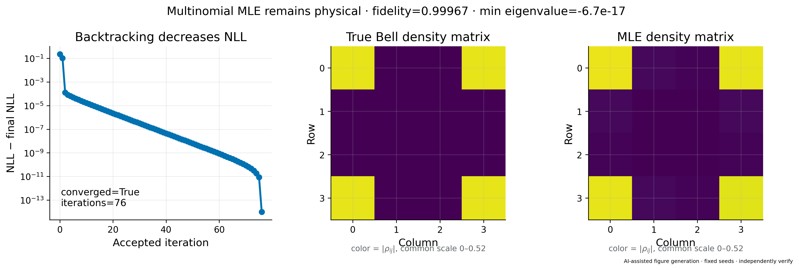
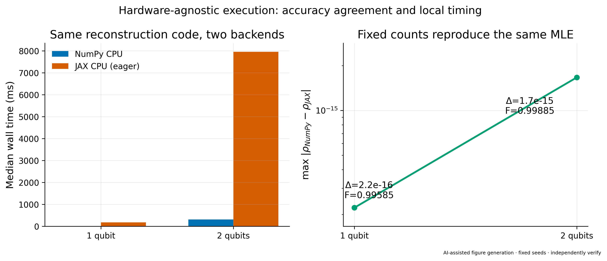
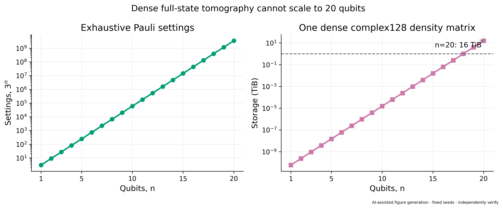

# Hardware-Agnostic Quantum State Reconstruction

## Reconstruction methods, validation, and finite-shot results

**Report date:** 17 August 2026  
**Scope:** state reconstruction only  
**Implementation:** [`state_reconstruction.py`](../../src/nbqs_qst/state_reconstruction/state_reconstruction.py)  
**Exact figure data:** [`poster_plot_data.json`](../figures/state_reconstruction/poster_plot_data.json)

> **Mandatory AI disclosure and verification status**  
> The reconstruction code, tests, analysis scripts, figures, and this report
> were prepared with generative-AI assistance. They have not yet been
> independently reviewed and must not be marked **verified** until the
> equations, source code, numerical results, and interpretations have been
> checked by a human reviewer.

---

## 1. Executive summary

This work implements a hardware-agnostic quantum-state reconstruction module
for count data generated by exhaustive local Pauli measurements. Three
estimators are compared:

1. **Linear inversion (LI)** in the orthogonal Pauli operator basis;
2. **Projected least squares (PLS)**, obtained by projecting LI onto the set of
   positive, unit-trace matrices;
3. **Multinomial maximum-likelihood estimation (MLE)** using projected gradient
   descent with Armijo backtracking.

The core implementation imports no NumPy, detects the array namespace from the
measurement counts, uses `complex128`, avoids in-place array updates, and has
been exercised on NumPy and JAX arrays. The MLE objective uses the exact
finite-shot multinomial model; no Gaussian noise is added.

Key numerical findings are:

- All **240 MLE runs** in the poster-quality Monte Carlo study converged:
  three target states, four shot levels, and 20 fixed seeds per condition.
- At 2,048 shots per setting, mean MLE infidelity was
  `9.41e-5` for one-qubit `|+y>`, `1.28e-4` for the two-qubit Bell state, and
  `6.23e-5` for the four-qubit GHZ state.
- Every LI estimate in this pure-state Monte Carlo set had a negative
  eigenvalue below `-1e-12`. This is expected finite-sample behavior and was
  deliberately not hidden by eigenvalue clipping.
- A representative Bell-state MLE converged in 76 accepted iterations with
  fidelity `0.999669` and minimum eigenvalue `-6.7e-17`, consistent with a
  positive semidefinite state up to floating-point round-off.
- NumPy and JAX reconstructed the same fixed-count MLE to a maximum matrix
  difference of `1.67e-15` in the tested cases.
- A dense 20-qubit `complex128` density matrix alone requires 16 TiB; dense
  exhaustive tomography therefore cannot meet a literal 20-qubit target
  without a structured, low-rank, tensor, or matrix-free formulation.

---

## 2. Reconstruction problem

For `n` qubits, the Hilbert-space dimension is `d = 2^n`. Each experiment
measures all `3^n` tensor-product settings

```text
b in {X, Y, Z}^n
```

with `N` shots per setting. Outcome `x` has Born probability

```text
p(b,x | rho) = Tr(E(b,x) rho),
```

and the setting-level count vector follows a multinomial distribution. Qubit 0
is the most significant outcome bit, and outcome bit 0/1 denotes Pauli
eigenvalue +1/-1. Reconstruction consumes backend-native integer count vectors
directly; it does not resample raw outcomes.

The desired estimate must satisfy

```text
rho = rho^dagger,   rho >= 0,   Tr(rho) = 1.
```

### 2.1 Linear inversion

The `n`-qubit Pauli strings form an orthogonal operator basis, giving

```text
rho_LI = (1 / 2^n) sum_P <P>_hat P.
```

Each Pauli expectation is estimated by pooling parity counts from every
compatible measurement setting. LI is a fast, transparent baseline, but finite
sampling can produce negative eigenvalues.

### 2.2 Projected least squares

PLS diagonalizes the Hermitian LI estimate and projects its eigenvalues onto
the probability simplex. The result is physical and inexpensive, but this
projection is not equivalent to multinomial MLE.

### 2.3 Multinomial MLE

The normalized negative log-likelihood is

```text
C(rho) = -(1 / N_total) sum_(b,x:c>0) c(b,x) log Tr(E(b,x) rho).
```

The implementation evaluates the analytic density-matrix gradient and applies
projected gradient descent. Every candidate is projected onto the density-
matrix set, and Armijo backtracking accepts only finite, objective-decreasing
steps. A maximally mixed initial state ensures nonzero probability for every
Pauli outcome.

---

## 3. Experimental design

The reconstruction-quality study uses three pure target states:

- one-qubit `|+y> = (|0> + i|1>) / sqrt(2)`;
- two-qubit Bell state `|Phi+> = (|00> + |11>) / sqrt(2)`;
- four-qubit `|GHZ4> = (|0000> + |1111>) / sqrt(2)`.

For each target, measurements were generated at 32, 128, 512, and 2,048 shots
per Pauli setting. Each condition used 20 fixed seeds, giving 240 independent
reconstruction runs. The shaded bands in the figure are empirical 16th–84th
percentiles, not formal confidence intervals. Random sampling originates only
from the standard-library-backed measurement simulator.

The principal quality metric is squared Uhlmann fidelity,

```text
F(rho, sigma) = [Tr sqrt(sqrt(rho) sigma sqrt(rho))]^2,
```

reported as infidelity `1 - F`. Fidelity is reported only for the physical PLS
and MLE estimates. LI is summarized separately by its nonphysical rate.

---

## 4. Reconstruction quality from one to four qubits



[Vector PDF](../figures/state_reconstruction/poster_reconstruction_quality.pdf)

### Mean infidelity over 20 fixed seeds

| Target | Shots per setting | PLS mean `1-F` | MLE mean `1-F` | MLE converged | Nonphysical LI |
|---|---:|---:|---:|---:|---:|
| `|+y>` | 32 | 1.672e-2 | 8.297e-3 | 20/20 | 100% |
| `|+y>` | 128 | 3.463e-3 | 1.576e-3 | 20/20 | 100% |
| `|+y>` | 512 | 1.357e-3 | 6.076e-4 | 20/20 | 100% |
| `|+y>` | 2,048 | 2.114e-4 | 9.410e-5 | 20/20 | 100% |
| Bell `|Phi+>` | 32 | 5.697e-2 | 8.031e-3 | 20/20 | 100% |
| Bell `|Phi+>` | 128 | 3.020e-2 | 1.931e-3 | 20/20 | 100% |
| Bell `|Phi+>` | 512 | 1.353e-2 | 6.267e-4 | 20/20 | 100% |
| Bell `|Phi+>` | 2,048 | 6.933e-3 | 1.284e-4 | 20/20 | 100% |
| `|GHZ4>` | 32 | 1.214e-1 | 4.385e-3 | 20/20 | 100% |
| `|GHZ4>` | 128 | 5.940e-2 | 1.138e-3 | 20/20 | 100% |
| `|GHZ4>` | 512 | 2.979e-2 | 2.639e-4 | 20/20 | 100% |
| `|GHZ4>` | 2,048 | 1.465e-2 | 6.229e-5 | 20/20 | 100% |

MLE consistently achieves lower mean infidelity than PLS for these simulated
pure states. The difference grows with qubit count: eigenvalue projection makes
PLS physical but does not optimize the correct multinomial likelihood. The LI
result should not be interpreted as a failed implementation; negative
eigenvalues are a known consequence of unbiased finite-sample inversion near
the boundary of state space.

The horizontal axis is **shots per setting**. Total state copies are
`N * 3^n`, so the four-qubit study uses 81 times the plotted value per dataset.

---

## 5. MLE convergence and physicality



[Vector PDF](../figures/state_reconstruction/poster_mle_convergence.pdf)

The representative Bell-state dataset used 256 shots per setting and fixed
seed 71. Backtracking produced a monotone accepted objective history.

| Quantity | Result |
|---|---:|
| Converged | Yes |
| Accepted iterations | 76 |
| Fidelity | 0.9996689 |
| Minimum eigenvalue | `-6.7e-17` |
| Initial normalized NLL | 1.3862944 |
| Final normalized NLL | 1.1549775 |

The tiny negative minimum eigenvalue is many orders of magnitude below the
statistical effects and is consistent with eigensolver round-off at the
positive-semidefinite boundary. The matrix images use one common color scale
for `|rho_ij|`.

---

## 6. Backend agreement and local timing



[Vector PDF](../figures/state_reconstruction/poster_reconstruction_backends.pdf)

| Case | NumPy CPU | JAX CPU, eager | Iterations | Max matrix difference | Fidelity |
|---|---:|---:|---:|---:|---:|
| 1 qubit | 8.04 ms | 176.36 ms | 18 | `2.22e-16` | 0.995850 |
| 2 qubits | 313.46 ms | 7,959.44 ms | 179 | `1.67e-15` | 0.998850 |

Both backends converged using the same fixed counts and MLE tolerance `1e-8`.
The reconstructed states agree to floating-point precision. These runtime
values are local eager-CPU measurements after one warm-up run. They are not GPU
results, do not use JIT compilation, and must not be generalized as a broad
performance ranking of NumPy and JAX.

The code is written using operations shared by NumPy, CuPy, JAX, and PyTorch,
but only the locally installed NumPy and JAX backends were executed for this
report.

---

## 7. Dense scaling limit



[Vector PDF](../figures/state_reconstruction/poster_reconstruction_resource_limit.pdf)

| Qubits | Pauli settings `3^n` | One dense `complex128` density matrix |
|---:|---:|---:|
| 1 | 3 | 64 B |
| 2 | 9 | 256 B |
| 4 | 81 | 4 KiB |
| 8 | 6,561 | 1 MiB |
| 12 | 531,441 | 256 MiB |
| 16 | 43,046,721 | 64 GiB |
| 20 | 3,486,784,401 | 16 TiB |

Four-qubit dense tomography is inexpensive and is included in the automated
regression suite. The same representation becomes untenable well before 20
qubits because optimizer temporaries, rotations, counts, and gradients require
additional memory beyond the density matrix itself. A high-qubit extension
must change the representation or the estimation target rather than merely
move the dense algorithm to a larger accelerator.

---

## 8. Automated validation

The reconstruction tests cover:

- the `|+y>` imaginary off-diagonal and Y-sign convention;
- exact count-based Pauli linear inversion;
- an intentionally nonphysical finite-shot LI fixture;
- physical PLS projection;
- a one-qubit MLE with a known symmetric solution;
- two-qubit Bell and four-qubit GHZ MLE reconstruction;
- monotone accepted likelihood history and density-matrix diagnostics;
- analytic likelihood gradient versus a central finite difference;
- reconstruction error proportional to `1/sqrt(N)`;
- purity, fidelity, and trace-distance definitions;
- fixed-count NumPy/JAX agreement;
- malformed input and invalid-option failures.

At report generation time:

```text
Reconstruction tests: 14 passed
Full project test suite: 55 passed
```

Run the tests and regenerate all reconstruction figures from the project root:

```powershell
python -m pytest tests/test_reconstruction.py -q
python -m pytest -q
python tests/analysis/generate_reconstruction_figures.py
```

Each plot is exported as a 300-DPI PNG and vector PDF. Exact values, fixed
seeds, convergence flags, backend metadata, and runtime measurements are stored
in [`poster_plot_data.json`](../figures/state_reconstruction/poster_plot_data.json).

---

## 9. Limitations and interpretation cautions

- The study uses an ideal measurement model with finite sampling as the only
  noise source. It does not include state-preparation, gate, calibration, or
  detector errors.
- Fixed-seed Monte Carlo percentiles are descriptive empirical bands, not
  formal confidence or credible intervals.
- Positivity-constrained estimators can be biased, especially for pure and
  nearly pure states on the boundary of state space.
- Fidelity must not be applied uncritically to nonphysical LI matrices. This
  report instead exposes their negative eigenvalues.
- The present MLE is dense and exhaustive. The four-qubit result does not imply
  favorable asymptotic scaling.
- Local eager-CPU timings are implementation diagnostics, not portable hardware
  benchmarks.
- All AI-assisted material requires independent scientific and software review.

---

## 10. Primary references

1. Z. Hradil, “Quantum-state estimation,” *Physical Review A* **55**, R1561
   (1997). [DOI](https://doi.org/10.1103/PhysRevA.55.R1561)
2. D. F. V. James, P. G. Kwiat, W. J. Munro, and A. G. White, “On the
   Measurement of Qubits,” *Physical Review A* **64**, 052312 (2001).
   [DOI](https://doi.org/10.1103/PhysRevA.64.052312)
3. J. Shang, Z. Zhang, and H. K. Ng, “Superfast maximum-likelihood
   reconstruction for quantum tomography,” *Physical Review A* **95**, 062336
   (2017). [arXiv](https://arxiv.org/abs/1609.07881)
4. E. Bolduc, G. C. Knee, E. Gauger, and J. Leach, “Projected gradient descent
   algorithms for quantum state tomography,” *npj Quantum Information* **3**,
   44 (2017). [DOI](https://doi.org/10.1038/s41534-017-0043-1)
5. M. Guta, J. Kahn, R. Kueng, and J. A. Tropp, “Fast state tomography with
   optimal error bounds,” *Journal of Physics A* **53**, 204001 (2020).
   [arXiv](https://arxiv.org/abs/1809.11162)
